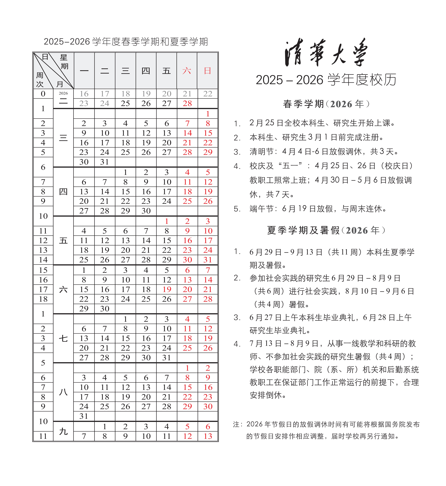

# 2026S 毕设计划安排

## 1. 2026 年春季学期校历

## 2. 2026 年春季学期计划表

春季学期开始前完成：

- rCore-N 异步 timer
- rCore-N + 已有异步串口驱动，在 QEMU 上跑通
- 学习星光二开发板的使用

|开学第X周|内容|备注|
|---|---|---|
|1-4|rCore-N + 已有异步串口驱动，上板运行||
|5|开始编写块设备异步驱动逻辑|改成 rust future 形式|
|6|中期|20260403 前完成，即第六周周五前|
|7|块设备异步驱动逻辑编写初步完成||
|8|块设备异步驱动 QEMU||
|9-10|块设备异步驱动上板||
|11-13|写论文||
|14|论文查重|初步安排在十四周|
|15|准备答辩与实验演示||
|16|最终答辩|20260610 前完成，即十六周周三前|