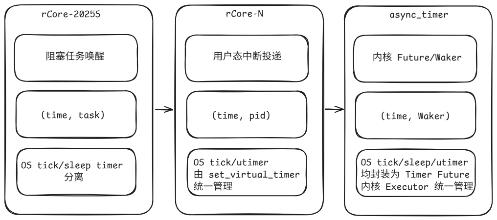

---

# Rust 异步驱动模块设计与实现
基于 rCore-N 的内核异步 timer 原型设计与实现
答辩人：XXX
指导教师：XXX
院系：XXX
日期：XXXX 年 XX 月

---

# 目录

- xxx

---

# 研究背景与问题

- 多核内核需要同时处理调度、中断、系统调用和定时事件
- 传统 busy-wait 或同步阻塞模型在复杂 I/O 与多核场景下面临效率与并发问题
- Rust `Future`/`Waker` 提供了将“等待”表达为异步状态机的可能
- 本文关注的问题是：能否把 Rust 异步机制接入 rCore-N 的内核 timer 路径

---

# 论文目标与主要工作

- 以 rCore-N 为平台，设计并实现一个基于 `Future/Waker` 的异步 timer 原型
- 打通 `Timer Future -> Waker 注册 -> S Timer 中断 -> executor poll` 的完整链路
- 在不破坏 rCore-N 现有调度结构的前提下，为 `sleep_blocking` 提供内核态支撑
- 通过实验验证其可用性

---

# 现有机制与本文切入点

- rCore-Tutorial-2025S 提供的是固定 tick + 阻塞式 `sys_sleep`
- rCore-N 中真正有意义的已有 timer 机制是 `sys_set_timer()`，它服务于用户态中断事件投递
- rCore-N 原始 `sleep` 更接近 busy-wait，并没有形成内核态 `sys_sleep` 语义
- 因此本文的切入点是在内核态重新实现基于 Rust Future 的 `sys_sleep`

---

# 总体设计思路

## Embassy 介绍

### embassy-executor 状态转移

### embassy-rp Timer 实现

---

# 总体设计思路

- 不直接照搬 Embassy，也不直接恢复传统 blocked sleep
- 参考 Embassy 模式：在内核中引入 `Timer` Future、`Waker`、`TimerDriver`、`Executor` 和 timer queue
- `sys_sleep` 采用 suspend-loop 折中实现，避免在中断上下文直接修改共享 `ready_queue`
- os tick/sleep timer/utimer 统一封装为 Timer Future 由内核 Executor 统一管理
- wake 与 poll 统一在 S Timer Trap 中完成，以保持 OS tick 调度上下文一致

---

# 核心机制：Timer Future 如何被挂起与唤醒

- `Timer::poll` 在未到期时注册当前任务的 `Waker`，并返回 `Poll::Pending`
- timer 到期后，time driver 根据到期事件唤醒对应异步任务
- executor 重新 poll 已就绪任务，完成 Future 恢复执行
- 这使“定时等待”从同步函数逻辑转变为可调度的异步状态机

---

# 当前实现的关键取舍

- 初始设想是 blocked `sys_sleep`，但受两段式 `suspend_current_and_run_next()` 和共享 `ready_queue` 约束而放弃
- 当前实现中，sleep 任务不会真正退出调度体系，而是反复让出 CPU 直到超时条件成立
- 优点是实现稳定、能验证 Future/Waker 链路
- 缺点是等待期间仍可能被重复调度，效率不如理想 blocked sleep

---

# 取舍：直接移植/引入 Embassy

- embassy 中断模式 executor
    - 比如将 executor poll 放到 rCore-N 中空闲的 S Soft 上下文中
- 直接用的问题
    - poll 不能随便挪出 S Timer 中断上下文
    - 否则 os tick Timer Future 试图 suspend 切换上下文时会出问题
- 解决方法：把 wake 和 executor poll 同时放到 S Timer 中断上下文

---

# 取舍：os tick 封装为 Timer Future

- 问题：async_timer 实现为 Timer Future，当 Poll::Ready 后，如果直接在回调中 suspend_current_and_run_next() 切走上下文，会中途打断 Executor poll 过程

- 解决方法：延后处理。在 poll 中先设置 PENDING_OS_TICK，等 Executor 队列中所有任务 poll 结束后处理

---

# 取舍：os tick 独立于 Timer Future

- 既然 os tick 封装为 Timer Future 进行 poll 会遇到上下文问题，为什么不让 os tick 独立于 Timer Future，即 sleep timer 封装为 Timer Future，os tick 逻辑不变
    - 因为这样 os tick -> sbi_set_timer 和 sleep timer -> Timer Future -> time_driver -> sbi_set_timer，经由两套逻辑设置的 timer 会互相覆盖

---

# 取舍：实现基于 blocked sys_sleep

- rCore-N 运行在多 hart 环境，多个 hart 共享全局 `ready_queue`
- 若沿用传统 blocked sleep，timer 到期后需要在中断上下文中重新入队任务
- 这会引入共享 `ready_queue` 持锁、竞争以及调度一致性问题
- 本文实验中，直接在 timer 中断路径中操作共享 `ready_queue` 会触发内核 panic
- 解决方法：sys_sleep 内部实现一个 suspend-loop，async_timer 完成后回调修改循环标志位退出循环

---

# 正确性：Rust Future 无栈协程栈帧分析

---

# 可用性：实验设计与运行演示

- 实验环境：QEMU，4 hart
- 用户库 `sleep_blocking` 调用底层 sys_sleep 系统调用
- 验证内容包括无栈协程行为和多核下 `sleep_blocking` 的响应表现
- 三组实验分别关注基础误差、CPU load 压力下的并发表现、不同到期时间的顺序正确性
- 视频建议放在这一页：演示 `sleep_blocking` 在多核环境中的实际运行，以及加入 `cpu_load` 后系统仍能按预期返回
视频占位：`sleep_blocking + cpu_load` 运行演示

---

# 实验结果一：基础响应误差

- 单进程 `sleep_blocking` 能稳定返回，未出现提前返回、永久等待或内核异常
- 10ms、50ms、100ms、500ms 四组测试的平均误差约为 1.4ms 到 1.9ms
- 等待时间越长，固定调度与中断开销的相对影响越小
- 说明异步 timer 已经能够支撑基本的内核定时等待语义

图占位：表 4.1《不同目标等待时间下 sleep_blocking 的响应结果》

---

# 实验结果二：并发压力与到期顺序

- 在 `cpu_load` 存在时，所有 `sleep_blocking` 任务仍能正常返回，没有出现 timer 丢失或 panic
- 当 `CPU load = 4`、`sleep 进程数 = 10` 时，100ms 目标等待的平均返回时间约为 103.2ms，最大值为 107ms
- 不同目标时间并发测试中，`10ms -> 20ms -> 50ms -> 100ms` 的到期顺序统计正确率为 100%
- 说明 timer queue 能按到期时间组织事件，系统在调度压力下仍保持基本正确性

图占位：表 4.2《不同 CPU load 压力下 sleep_blocking 的响应结果》
图占位：表 4.3《不同目标时间并发 sleep 的返回顺序测试结果》
图占位：表 4.4《不同目标时间并发 sleep 的返回顺序统计结果》

---

# 额外验证：Future 的无栈协程特性

- 本文不仅验证“能否睡醒”，还验证“挂起后是否真的回退调用栈”
- 当 Future 返回 `Poll::Pending` 后，控制流回退到执行器附近，而不是保留独立运行栈
- 这符合 Rust Future 的无栈协程语义
- 说明本文实现并不是简单回调式延时，而是把内核定时等待真正接入了 Future/Waker 模型

图占位：论文图 4.2《Future 返回 Poll::Pending 后调用栈逐层回退示意图》

---

# 结论

- 本文在 rCore-N 中实现了一个基于 Rust `Future/Waker` 的异步 timer 原型
- 完成了从 Future 挂起、Waker 注册、timer 到期、中断唤醒到 executor 重新 poll 的完整链路
- 在多核环境下，`sleep_blocking` 能够稳定工作，并保持可解释范围内的响应误差
- 结果表明：Rust 异步机制接入操作系统内核 timer 路径是可行的

---

# 局限与后续工作

- 当前 `sys_sleep` 仍是 suspend-loop 折中实现，不是真正的 blocked sleep
- timer queue 目前基于 `Vec`，大规模并发下存在线性扫描开销
- 异步任务生命周期管理、跨 hart wake 与迁移、poll 上下文拆分仍需完善
- 后续重点是 deferred wake、真正 blocked sleep、timer 数据结构优化以及异步驱动推广到串口/块设备/网络等场景

---

# 致谢

感谢毕设指导老师

感谢答辩老师

---