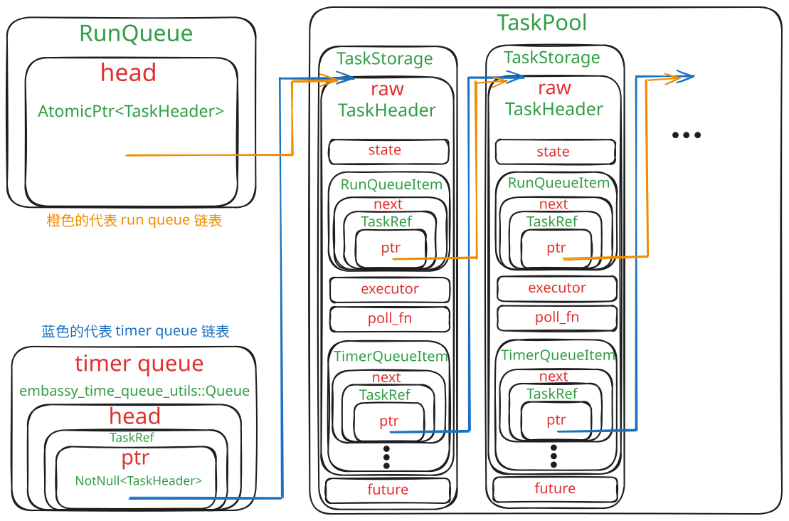
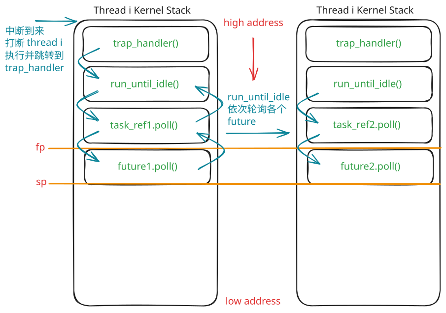

# Rust 异步驱动模块设计与实现

## 0. 摘要

随着操作系统内核逐渐面向多核并发、低延迟 I/O 和复杂外设管理场景发展，传统同步阻塞式驱动模型在资源利用率和并发扩展性方面逐渐暴露出局限。Rust 语言提供的 `async/await`、`Future` 和 `Waker` 机制，为在系统软件中构建轻量级异步任务模型提供了新的可能 [1][2][3]。相比传统线程模型，Rust Future 属于无栈协程，其挂起状态由编译器生成的状态机保存，不需要为每个异步任务维护独立运行栈，因此适合嵌入式系统和操作系统内核等资源敏感场景。

本文围绕“Rust 异步驱动模块设计与实现”这一主题，以 rCore-N 为实验平台，设计并实现了一个基于 Rust Future/Waker 机制的异步 timer 原型模块。首先，本文分析了 Rust Future 无栈协程模型、Embassy 异步运行时的任务调度与 timer 唤醒机制，以及 rCore 和 rCore-N 在 timer、调度和 sleep 语义上的差异。其次，本文在 rCore-N 中实现了一个异步 timer 子模块，包括 `Timer` Future、任务执行器、Waker 转换、定时队列和 time driver 等部分，并将其接入 S 态 timer 中断路径。针对 rCore-N 多核共享 `ready_queue` 和 S Timer Trap 上下文约束，本文没有直接照搬 Embassy 的中断执行器模型，也没有简单恢复传统 blocked sleep，而是采用 suspend-loop `sys_sleep` 与 S Timer Trap 内统一 wake/poll 的工程折中方案。

在实验验证方面，本文从 Rust Future 无栈协程特性和多核环境下 sleep 响应行为两个角度进行测试。无栈协程实验用于观察 Future 返回 `Poll::Pending` 后调用栈是否回退到执行器附近，从而验证 Future 保存状态而非保存独立栈的运行特征；sleep 响应测试则通过基础响应误差测试、并发 sleep 与 CPU load 压力测试、不同到期顺序测试，验证异步 timer 在 rCore-N 多核环境下的基本可用性。实验结果表明，本文实现的异步 timer 原型能够将 Future/Waker 机制接入内核 S Timer 路径，并支持用户态 `sleep_blocking` 在目标时间附近返回。不过，当前实现仍存在 suspend-loop sleep 效率有限、timer queue 线性扫描、任务生命周期管理不完善以及中断上下文中执行 poll 可能延长 trap 处理时间等问题。最后，本文对后续优化方向进行了展望，包括 deferred wake 机制、真正的 blocked sleep、timer queue 数据结构优化和多 hart 异步执行器设计等。

**关键词：** Rust；Future；异步驱动；rCore-N；Timer；Waker；无栈协程

## 1. 绪论

### 1.1 研究背景

操作系统内核需要同时处理进程调度、外设中断、系统调用、定时器事件以及 I/O 请求等多类并发事件。传统内核通常采用同步阻塞式接口组织这些逻辑：当任务等待某个事件尚未完成时，可能通过忙等、阻塞挂起或轮询方式等待事件发生。对于教学操作系统而言，这种设计结构清晰、实现直接，便于理解操作系统的基本原理；但在多核并发和复杂 I/O 场景下，传统同步模型容易带来额外的 CPU 空转、上下文切换开销以及共享数据结构竞争问题。

近年来，异步编程模型在用户态高性能网络服务、嵌入式系统和系统软件中得到广泛关注。Rust 语言原生支持 `async/await` 语法，并通过 `Future` trait、`Poll` 状态和 `Waker` 机制构建了基于轮询的异步执行模型 [1][2][3]。与传统线程相比，Rust Future 是一种无栈协程：异步任务在挂起时不会保存独立调用栈，而是将跨越 `await` 点的局部状态保存到编译器生成的状态机对象中。这种模型具有较低的内存占用和较强的可组合性，为在操作系统内核中实现轻量级异步驱动提供了可能。

在嵌入式 Rust 生态中，Embassy 已经较完整地展示了 `Future`、`Waker`、执行器、中断和硬件 timer 结合的设计方式 [8][9][11]。Embassy 的 timer 机制能够在任务等待定时事件时注册 Waker，并在硬件 timer 中断到来后唤醒对应任务，使其重新进入执行器运行队列。该机制说明，异步 timer 并不是简单的延时函数，而是需要建立从 Future、Waker、timer queue、硬件中断到 executor poll 的完整唤醒链路。

rCore 是使用 Rust 语言实现的教学操作系统内核，而 rCore-N 是在 rCore 基础上进一步扩展的研究型分支 [14][15][16]。与标准 rCore 相比，rCore-N 引入了多核执行、用户态中断、virtual timer 和异步串口等机制，同时也删去了标准 rCore 中基于 `Blocked` 状态和定时器等待队列的 `sys_sleep` 实现。rCore-N 用户库中的 `sleep` 更接近用户态忙等式延时，而不是内核调度意义上的阻塞睡眠。因此，在 rCore-N 中重新讨论基于 Rust Future 的异步 timer 和 sleep 机制，既有助于探索 Rust 异步模型在内核中的适用性，也能暴露多核调度、timer 中断和任务唤醒之间的工程约束。

基于上述背景，本文以 rCore-N 为实验平台，尝试设计并实现一个内核级异步 timer 原型模块。该模块借鉴 Embassy timer 的核心思想，但不直接移植 Embassy 执行器，而是结合 rCore-N 的 S Timer Trap、调度器和多核共享队列特点进行适配。本文希望通过这一实验回答以下问题：Rust Future/Waker 机制能否接入 rCore-N 的 timer 路径？异步 timer 如何在内核中完成任务挂起与唤醒？在多核共享调度队列和中断上下文限制下，传统 blocked sleep 与异步 sleep 的实现会遇到哪些工程取舍？

### 1.2 国内外研究现状

异步 I/O 和事件驱动机制是操作系统和高性能服务端系统中的重要研究方向 [6][7][20]。传统操作系统中，异步 I/O 通常通过中断、等待队列、事件通知和回调机制实现。例如，当设备尚未就绪时，内核可以将任务挂入等待队列；当设备中断到来后，再由中断处理逻辑唤醒等待任务。这类机制在 Linux 等成熟内核中已经长期存在，但其接口和实现通常与 C 语言、线程调度、等待队列和内核同步机制紧密绑定。

在用户态编程领域，异步编程模型已经形成了较成熟的生态。例如 JavaScript 使用事件循环和回调机制组织异步任务，Go 使用轻量级 goroutine 和运行时调度器管理并发，Rust 则采用基于 `Future` 的零成本异步抽象。Rust 的异步模型并不规定具体运行时，而是将任务状态机、轮询接口和唤醒机制分离出来，由 Tokio、async-std、Embassy 等运行时根据不同场景实现调度器和 reactor [1][5][8]。这种解耦设计使 Rust 异步机制既可以用于用户态网络服务，也可以被移植到 `no_std` 嵌入式和内核环境中。

在嵌入式领域，Embassy 是较有代表性的 Rust 异步运行时 [8][9]。它面向 `no_std` 环境提供异步任务、执行器、定时器和外设驱动支持。Embassy 的 timer 机制通过 Timer Future 表达定时等待，通过 time driver 管理硬件 timer，通过 Waker 或 TaskRef 将到期事件映射回等待任务。这种设计避免了传统阻塞等待和忙轮询，使嵌入式程序能够以较低资源开销表达并发逻辑。Embassy 的实现对本文具有直接参考意义，尤其是在 Timer Future、Waker、timer queue、硬件中断和 executor 之间的协作关系方面。

在操作系统教学和研究领域，rCore 展示了 Rust 语言在内核实现中的可行性 [14][15]。标准 rCore-Tutorial 主要面向教学，采用较直接的同步阻塞式机制组织任务调度、timer 和 `sys_sleep`。rCore-N 在 rCore 基础上进行了多核、用户态中断和异步 I/O 方向的扩展，为探索 Rust 异步模型在内核中的应用提供了更合适的平台。不过，rCore-N 的现有 sleep 机制仍然存在忙等或工程简化问题，并没有形成完整的 Future/Waker 异步 timer 模型。因此，如何在 rCore-N 中引入类似 Embassy 的异步 timer 思路，并与内核 S Timer Trap、调度器和多核同步机制结合，是本文关注的核心问题。

总体来看，现有研究和工程实践已经分别在用户态异步运行时、嵌入式异步框架和 Rust 教学内核方面积累了较多经验，但将 Rust Future/Waker 机制直接接入多核操作系统内核 timer 路径仍然具有探索价值。本文的工作并不试图构建完整通用的异步内核运行时，而是以 timer 和 sleep 为切入点，研究 Future/Waker 异步模型在 rCore-N 内核中的具体适配方式、可行性与局限性。

### 1.3 本文主要内容

本文围绕 rCore-N 中异步 timer 模块的设计与实现展开，主要工作包括以下几个方面。

第一，分析 Rust Future 无栈协程模型。本文介绍 Rust Future 的状态机本质、`Poll::Pending` 与 `Poll::Ready` 语义、`Waker` 唤醒机制以及 executor 与 reactor 的关系，并结合本文实现说明 Future 在内核中运行时如何复用当前执行上下文栈，而不是为每个异步任务维护独立运行栈。

第二，分析 Embassy 的异步 timer 机制。本文从任务模型、执行器、Waker、TaskRef、timer queue、time driver 和中断执行器等方面梳理 Embassy 的实现思路，重点关注定时等待任务如何注册唤醒信息、timer 中断如何唤醒任务，以及执行器如何重新 poll 已就绪任务，并从中提炼对内核异步 timer 设计的启示。

第三，比较 rCore 与 rCore-N 的 timer 和 sleep 机制。本文说明标准 rCore-2025S 采用固定周期 tick 与软件 timer heap 检查相结合的方式实现调度和阻塞式 `sys_sleep`；而 rCore-N 引入 virtual timer 机制，使 OS 时间片事件和用户态定时事件进入统一 timer 管理框架。本文进一步分析 rCore-N 用户态忙等 sleep 的局限，以及多核共享 `ready_queue` 给 blocked sleep 唤醒带来的同步风险。

第四，设计并实现 rCore-N 异步 timer 原型。本文在 `os/src/async_timer` 中实现了 `Timer` Future、每 hart 独立的 `TimerDriver` 与 `Executor`、基于 `Vec` 的 timer queue、`TaskHeader`/`TaskRef`/`RawWaker` 唤醒链路，并将异步 timer 接入 S Timer Trap。针对 rCore-N 的上下文约束，本文最终放弃 S Software Interrupt executor 方案，选择在 S Timer Trap 中统一完成 wake 与 poll，并通过 `PENDING_OS_TICK` 标志避免 executor poll 重入和中途切换上下文。

第五，完成异步 timer 的正确性与响应误差测试。本文通过 Future 无栈协程验证实验观察 `Poll::Pending` 返回后调用栈回收行为，通过基础响应误差测试、并发 sleep 与 CPU load 压力测试、不同到期顺序测试验证 `sleep_blocking` 在多核环境下的可用性。实验结果用于说明本文实现能够完成基本定时唤醒，但仍受到 suspend-loop sleep、调度恢复延迟和 timer queue 线性扫描等因素影响。

最后，总结当前实现存在的问题并提出后续优化方向。本文指出当前异步 timer 原型仍存在非真正 blocked sleep、timer queue 性能有限、任务生命周期管理不完善、跨 hart 任务迁移缺失和中断上下文 poll 开销等问题，并提出 deferred wake、timer queue 优化和跨 hart 异步调度等后续改进方向。

### 1.4 本文结构

本文共分为五章，各章内容安排如下。

第一章为绪论，介绍本文的研究背景、国内外研究现状、主要研究内容和论文结构，说明在 rCore-N 中探索 Rust 异步 timer 的动机与意义。

第二章为相关技术介绍，首先介绍 Rust Future 无栈协程模型，包括 Future trait、`Poll` 状态、`Waker` 唤醒机制和异步运行时解耦特性；随后介绍 Embassy 异步运行时，重点说明其任务模型、执行器、Waker、TaskRef 以及中断执行器机制；最后介绍 rCore 和 rCore-N 的基本结构，说明 rCore-N 的多核、用户态中断、virtual timer 和 busy-wait sleep 等机制为本文工作提供的实验背景。

第三章为 timer 基本机制，首先介绍 RISC-V timer 的基本硬件机制和操作系统软件 timer 的组织方式；然后分析 rCore-2025S 的固定 tick 与阻塞式 `sys_sleep`，以及 rCore-N 的 virtual timer、用户态 timer 事件投递和 sleep 机制局限；最后结合 Embassy timer 的实现，进一步说明异步 timer 的 Future/Waker 唤醒链路，为第四章的实现设计提供参考。

第四章为异步驱动模块设计与实现，详细说明本文在 rCore-N 中实现的异步 timer 原型。该章包括设计目标与约束、blocked sleep 初始设想及放弃原因、suspend-loop `sys_sleep` 折中实现、Timer Future、TaskRef/TaskHeader/Waker 转换、timer queue 与 time driver、S Timer Trap 中统一 wake 与 poll 等内容，并通过实验验证异步 timer 的无栈协程特性与多核下 sleep 响应行为。

第五章为总结和展望，首先总结本文完成的主要工作和实验结论；随后分析当前实现中仍存在的问题，包括 suspend-loop sleep 的效率局限、timer queue 线性扫描、任务生命周期管理不完善以及中断上下文执行 poll 的开销等；最后提出后续进一步完善 rCore-N 异步 timer 和异步驱动框架的可能方向。

## 2. 相关技术介绍

### 2.1. Rust Future 无栈协程

在现代操作系统与高性能网络编程中，协程（Coroutine）作为一种用户态的轻量级并发单元，因其上下文切换开销远低于操作系统线程而被广泛应用。根据实现方式的不同，协程主要分为有栈协程（Stackful Coroutine）与无栈协程（Stackless Coroutine）。Rust 语言在构建其异步编程模型时，基于零成本抽象（Zero-cost Abstraction）的设计哲学，最终确立了以 Future Trait 为核心的无栈协程机制 [1][2]。

#### 2.1.1 无栈状态机模型

与 Go 语言中的 Goroutine 等有栈协程不同，Rust 的无栈协程不会为每个并发任务分配独立的运行栈空间。在 Rust 中，使用 async 关键字修饰的函数或代码块，在编译期会被 Rust 编译器（rustc）自动转换为一个实现了 Future 特型的匿名状态机（State Machine）[1][2]。

该状态机本质上是一个枚举（Enum）类型，其变体（Variant）对应了协程在各个 await 挂起点的状态，并负责保存跨越 await 点的所有局部变量。由于不依赖系统级的栈空间分配与切换，Rust 的无栈协程在创建和切换时的内存占用极小（通常仅需数十字节到数百字节），且生命周期完全由编译器静态推导和优化。这种极高的内存利用率和执行效率，使其非常适合应用于资源受限的嵌入式环境或对性能要求极高的操作系统内核级并发中。

#### 2.1.2 核心抽象：基于轮询的 Future Trait

Rust 异步生态的基础是标准库提供的 `core::future::Future` Trait [2]。与基于事件回调的模型不同，Rust 采用了基于轮询（Polling）的驱动模型。Future 的核心定义如下：

```rust
pub trait Future {
    type Output;
    fn poll(self: Pin<&mut Self>, cx: &mut Context<'_>) -> Poll<Self::Output>;
}
```

任何异步任务都必须实现该 Trait。执行器通过调用 `poll` 方法推动异步任务向前执行。`poll` 的返回值主要有两种：

* `Poll::Ready(Output)`：当异步任务已经计算完成时，`poll` 返回该状态，并携带最终执行结果，此时该 Future 对应的状态机终止。

* `Poll::Pending`：当异步任务由于等待 I/O 就绪、定时器未超时或其他异步事件尚未发生而无法继续推进时，`poll` 返回该状态。此时 Future 本身不会阻塞当前执行流，而是将控制权返回给上层 executor；executor 可以选择继续轮询其他已经就绪的任务，也可以在操作系统内核调度逻辑配合下让当前任务让出 CPU。

需要注意的是，`Poll::Pending` 只是 Future 层面的“暂时无法继续执行”语义，并不等价于操作系统线程或进程意义上的阻塞。Future 返回 `Pending` 后，当前这次 `poll` 调用会结束，调用栈会逐层返回给执行器；至于后续是否发生任务切换、是否让出 CPU，则取决于具体执行器和所在系统的调度策略。对于本文实现的 rCore-N 异步 timer 而言，Timer Future 返回 `Pending` 后，异步执行器会停止继续推进该任务，等待后续 S Timer 中断通过 Waker 将其重新标记为可轮询状态。

此外，`poll` 方法的接收者类型为 `Pin<&mut Self>` [4]。这是 Rust 为了保证异步状态机自引用安全而引入的内存固定机制。由于 async 函数在编译后会被转换为状态机，某些状态中可能保存跨越 `await` 点的局部变量引用，因此 Rust 需要保证 Future 在被 poll 期间不会被随意移动，从而避免内部引用失效或悬垂指针问题。

#### 2.1.3 唤醒机制与 Reactor-Executor 模型

由于 Future 的轮询是被动的，这就引发了一个核心问题：当 Future 返回 Poll::Pending 后，调度器应当在何时再次轮询该任务？为了避免无效的忙轮询（Busy Wait），Rust 引入了 Waker 唤醒机制 [3]。

在 poll 方法的参数中，Context 上下文对象封装了一个 Waker 实例。当底层的异步事件（例如本文后续章节将探讨的硬件定时器 Timer 触发或外设中断到来）就绪时，底层事件分发器（Reactor）会调用注册在其内部的 Waker::wake() 方法。该方法会将对应的任务标记为 Ready 就绪态，并通知顶层的执行器（Executor）将该任务重新推入可执行队列中等待下一次 poll。

#### 2.1.4 异步运行时的解耦特性

值得注意的是，Rust 标准库仅提供了 Future 接口、编译器状态机生成以及基础的唤醒抽象，并未提供内置的异步运行时（Runtime）[1][2]。这种极度的解耦设计虽然增加了初期的开发门槛，但赋予了开发者极大的灵活性。开发者可以根据具体的应用场景选择或定制 Executor 执行器。

例如，在传统的用户态应用程序中，通常会使用 Tokio 或 async-std；而在本文重点探讨的裸机（`no_std`）与微控制器环境中，则需要引入为嵌入式定制的宏观异步执行器（如 embassy）[5][8]，或在内核层面自主研发底层的协程调度框架（如在 rCore 中实现特定的异步驱动模块）。这种语言层面的机制支持，正是本文后续实现操作系统级异步驱动模块的理论基石。

### 2.2. embassy 介绍

正如上一节所述，Rust 语言虽然在语法层面原生支持了无栈协程与 Future Trait，但将其应用于实际的工程开发时，仍需要一个具体的异步运行时（Runtime）来负责任务的调度与事件的轮询。在传统的基于底层操作系统的用户态应用程序中，通常依赖 Tokio 等基于标准库（std）和堆内存分配的庞大运行时；然而，在操作系统内核（如 rCore）或微控制器（MCU）等缺乏底层 OS 支撑的裸机（Bare-metal/no_std）环境中，此类运行时无法运行。为此，Embassy 框架应运而生。

Embassy 是 Rust 嵌入式生态中较有代表性的异步运行时框架 [8][9]，其核心目标是在 `no_std` 的嵌入式环境中提供基于 `async/await` 的并发编程模型。与传统嵌入式程序中常见的阻塞式等待、轮询式状态机或中断回调式编程方式相比，Embassy 将异步任务、执行器、Waker、硬件中断和底层驱动进行统一组织，使应用层可以用接近同步代码的形式表达异步逻辑，同时由运行时负责在合适的时机恢复任务执行。

Embassy 的设计对本文具有重要参考价值。本文研究的目标是在 rCore-N 中设计并实现异步驱动模块，而 Embassy 已经在嵌入式场景下较完整地实现了基于 Rust Future 的任务调度、定时器等待和中断唤醒机制。因此，分析 Embassy 的任务模型和 timer 机制，有助于明确异步驱动中任务如何挂起、中断如何唤醒任务、唤醒后任务如何重新进入执行器等关键问题。

#### 2.2.1 Embassy 的任务模型

在 Embassy 中，用户通常使用 `#[embassy_executor::task]` 标记一个异步函数 [10]，使其成为可以被执行器调度的任务。该宏并不是直接让异步函数立即运行，而是将用户编写的 `async fn` 转换为符合 Embassy 任务模型的代码结构。而用户实现的 main 函数程序入口则需要使用 `#[embassy_executor::main]` 宏进行标记。分析使用 `cargo-expand` 工具宏展开的代码可以发现，`#[embassy_executor::task]` 宏大致会生成两层结构：一层是真正包含异步逻辑的隐藏函数，另一层是与原函数同名、返回 `SpawnToken` 的外层函数。也就是说，调用任务函数本身并不会执行任务，而是创建一个待调度的任务 token，后续需要通过 `Spawner::spawn()` 将任务交给执行器管理。

这种设计将任务创建和任务运行分离开来。任务创建阶段会从静态任务池 `TaskPool` 中获取一个任务槽位 `TaskStorage`，将异步函数生成的 Future 写入任务存储结构中；任务运行阶段则由执行器根据任务状态和运行队列决定何时调用 Future 的 `poll` 方法。由于嵌入式系统通常需要避免动态内存分配，Embassy 使用静态任务池保存任务相关数据，这一点对操作系统内核中的异步驱动设计也具有借鉴意义。

#### 2.2.2 执行器与任务调度

Embassy 提供了不同形式的执行器 [10]。以 RP2040 平台上的 `multiprio.rs` 示例为例 [13]，该程序创建了高优先级、中优先级和低优先级三个执行环境：高优先级和中优先级任务分别运行在 `SWI_IRQ_1` 和 `SWI_IRQ_0` 中断对应的 `InterruptExecutor` 中，低优先级任务则运行在线程模式下的普通 `Executor` 中。该示例展示了高优先级中断执行器可以打断中、低优先级执行器，中优先级执行器也可以打断低优先级执行器。

从调度流程上看，任务被 `Spawner::spawn()` 加入执行器后，并不会一直占用 CPU。执行器在合适的时机取出任务，对任务对应的 Future 调用 `poll`。如果 Future 返回 `Poll::Pending`，说明该任务当前无法继续执行，执行器会让出 CPU，等待后续事件将其唤醒；如果 Future 返回 `Poll::Ready`，说明任务执行完成，执行器会进入任务清理流程。

Embassy 任务内部使用状态位描述任务是否已经生成以及是否位于运行队列 run queue 中。任务状态表示为 `SPAWNED` 和 `RUN_QUEUED` 两个对应状态位的按位或，前者表示任务是否已经被创建，而后者表示任务此时是否被放进了 embassy 的运行队列里等待被 poll 并执行。在一个典型的定时器等待过程中，任务首次生成时进入 `SPAWNED | RUN_QUEUED` 状态；执行器取出任务并准备 `poll` 时，会清除 `RUN_QUEUED`；当任务执行到 `Timer::after_ticks(...).await` 并返回 `Pending` 后，任务保持 `SPAWNED` 状态但不在运行队列中；当定时器到期后，任务被唤醒并重新加入运行队列，状态再次变为 `SPAWNED | RUN_QUEUED`。这一状态变化过程可以概括为：`00 -> 11 -> 01 -> 11 -> 01 -> ...`。

#### 2.2.3 Waker、TaskRef 与任务唤醒

Rust Future 机制中，`Waker` 是异步任务挂起后重新被调度的关键。Future 在 `poll` 过程中如果无法继续执行，会返回 `Poll::Pending`；与此同时，它通常需要将当前任务对应的 `Waker` 注册到底层事件源中。后续当事件发生时，底层驱动或时间驱动通过调用 `Waker::wake()` 通知执行器：该任务已经具备继续执行的条件。

Embassy 对标准库中的 `Waker` 机制进行了面向自身执行器的特殊实现 [3][10]。根据 Embassy 的实现思路，`Waker` 底层通过 `RawWaker` 构造，其中 `RawWaker` 的 `data` 字段保存了指向任务头部结构的指针，`vtable` 字段则保存对应的唤醒函数表。当调用 `Waker::wake()` 时，最终会进入 Embassy 定义的唤醒逻辑，并将对应任务重新标记为可运行状态。

Embassy 中还存在 `TaskRef` 这一任务引用结构 [10]。`TaskRef` 可以理解为对任务头部结构 `TaskHeader` 指针的轻量封装，用于在执行器、Waker 和 timer queue 等模块之间传递任务身份。Embassy 可以通过 `from_task()` 从 `TaskRef` 构造 `Waker`，也可以在特定条件下从 Embassy 自己生成的 `Waker` 中反推出 `TaskRef`。这种设计使得任务唤醒路径不需要额外查找复杂对象，而是可以直接根据任务头指针定位对应任务。

`TaskHeader` 中包含任务调度所需的元信息，例如任务状态、运行队列节点、所属执行器指针以及任务 `poll_fn` 等。Embassy 在运行队列和定时器队列设计中大量采用 intrusive data structure 思想，即将队列节点直接嵌入任务控制结构内部，而不是为每个任务额外动态分配链表节点。这种方式可以减少运行时内存分配，适合嵌入式和内核这类资源敏感环境。

对于本文而言，Embassy 的 Waker 与 TaskRef 设计提供了重要启示：异步驱动模块不能只关注硬件事件本身，还需要建立从“硬件事件发生”到“具体 Future 任务被重新 poll”的映射关系。本文后续在 rCore-N 中实现异步 timer 时，也采用了类似的思路：通过 `TaskHeader` 保存异步任务状态，通过 `TaskRef` 在 Waker 唤醒路径中定位任务，并通过 `RawWaker` 将 Rust 标准 Waker 机制接入内核中的异步执行器。

#### 2.2.4 Embassy 的定时器等待机制概述

Embassy 的 timer 机制建立在 Rust Future 的 `poll` 语义之上 [1][11]。以 `Timer::after_secs(1).await` 为例，当执行器第一次 poll 该 Timer Future 时，如果当前时间尚未到达目标时间，Timer 会将当前任务的唤醒信息注册到底层时间驱动中，并返回 `Poll::Pending`。此后，该任务不再继续占用 CPU，而是等待硬件 timer 到期后被重新唤醒。

在具体平台上，Embassy 的时间驱动负责读取当前硬件时间、维护 timer queue、设置下一次硬件 alarm，并在 timer 中断到来后唤醒到期任务。随后，执行器会在合适的上下文中再次 poll 该任务，使其从 `.await` 之后继续执行。

因此，Embassy timer 的核心思想可以概括为：Future 负责表达等待语义，time driver 负责管理硬件时间和定时队列，Waker 或 TaskRef 负责将到期事件映射回等待任务，executor 负责恢复任务执行。关于 `Timer::poll`、`schedule_wake`、timer queue 和中断唤醒之间的具体源码链路，将在第 3.3 节中进一步展开。

#### 2.2.5 中断执行器与 `__pender()` 机制

Embassy 的一个重要特点是可以将执行器与中断机制结合 [10][13]。Embassy 针对不同的平台分别提供了两种模式的执行器：线程模式执行器和中断模式执行器。对于普通线程模式执行器，任务被唤醒后可以通过类似事件通知的方式唤醒主循环；对于 `InterruptExecutor`，任务被唤醒后则可以通过挂起指定软件中断的方式，使 CPU 进入对应中断处理函数，并在中断上下文中执行任务 poll。但 Embassy 并非为所有平台都提供了这两种模式的执行器可选。比如针对 Cortex-M 平台就提供了两种模式下的执行器实现，而 Riscv32 平台就只提供了线程模式执行器实现，不支持中断模式执行器。

在 Embassy 的执行器中，`__pender()` 用于任务唤醒 [10]，不同平台提供了不同的实现。当任务从未排队状态变为重新进入运行队列时，执行器会调用 `pender.pend()`，进而触发 `__pender(context)`。在 Cortex-M 平台上，如果目标是线程模式执行器，`__pender()` 会通过 `SEV` 唤醒处于 `WFE` 等待状态的执行器；如果目标是中断执行器，则通过 `NVIC::pend(irq)` 挂起对应的软件中断，使 CPU 尽快进入该中断处理函数。

以高优先级任务为例，其完整执行链路可以概括为：任务通过 `Spawner::spawn()` 加入 `InterruptExecutor`，执行器触发 `__pender()` 挂起对应软件中断；CPU 进入中断处理函数后调用 `EXECUTOR_HIGH.on_interrupt()`，执行器开始 poll 任务；任务执行到 Timer await 后注册唤醒并返回 `Pending`；硬件定时器中断到来后时间驱动调用 `wake_task()`；任务重新入队后再次触发 `__pender()`，最终再次进入软件中断执行器并继续 poll 该任务。

#### 2.2.6 对本文异步驱动设计的启示

Embassy 的实现表明，异步驱动模块的核心并不只是将驱动接口改写为 `async fn`，而是需要同时解决任务保存、事件注册、任务唤醒和执行器调度等问题。异步任务在返回 `Poll::Pending` 后必须保存自身状态，底层驱动需要记录该任务的唤醒信息，硬件事件发生后需要通过 Waker 或任务引用唤醒对应任务，最后由执行器统一恢复任务执行。

这一思路对本文具有直接启发。本文后续在 rCore-N 中实现异步 timer 时，也需要建立从 `Timer` Future、Waker、timer queue、S Timer 中断到 executor poll 的完整链路。不过，rCore-N 是多核操作系统内核，其 S Timer Trap 同时承担 OS 时间片调度职责，且多个 hart 共享 `ready_queue`。因此，本文不会直接照搬 Embassy 的执行器模型，而是在借鉴其 Future/Waker/timer queue 思路的基础上，根据 rCore-N 的中断上下文和调度约束重新设计。

### 2.3 rCore 介绍

rCore 是由清华大学计算机系操作系统实验室及 rcore-os 社区主导开发的一款基于 Rust 语言的开源操作系统内核 [14][15]。与传统基于 C 语言实现的教学内核相比，rCore 的重要特点在于将 Rust 的所有权、生命周期和类型系统引入操作系统内核开发过程，使内核在保持底层控制能力的同时，尽可能利用编译期检查减少内存安全和并发安全问题。

本文关注的是在 rCore-N 中引入 Rust 异步机制并改造 timer 相关路径。由于 rCore-N 是在 rCore 实验基础上进一步演化而来，因此有必要先介绍标准 rCore 的基本结构，尤其是其任务管理、陷阱处理、时钟中断与睡眠机制。这些内容构成后续分析 rCore-N 差异以及设计异步 timer 模块的基础。

#### 2.3.1 基于 Rust 的内核实现

传统操作系统内核通常采用 C/C++ 编写，开发者需要手动管理指针、对象生命周期和并发访问关系，容易出现空指针解引用、释放后使用、缓冲区越界以及数据竞争等问题。rCore 选择 Rust 作为主要实现语言，试图在教学内核中展示一种更安全的系统编程方式。

Rust 的所有权和生命周期机制使许多内存错误能够在编译期被发现。例如，内核中的某些资源对象只能有唯一所有者，引用必须满足生命周期约束，已经释放的对象不能继续被访问。对于共享数据结构，Rust 还通过 `Send` 和 `Sync` 等标记 trait 约束跨线程或跨执行上下文的数据访问方式。虽然操作系统内核仍然不可避免地需要使用 `unsafe` 代码访问硬件寄存器、操作页表或完成上下文切换，但 Rust 的类型系统能够将不安全代码限制在相对集中的底层模块中，从而提升整体代码的可维护性和安全性。

对于本文而言，rCore 的意义不仅在于其使用 Rust 编写，更在于它提供了一个适合观察 Rust 与操作系统内核机制结合方式的实验平台。本文后续引入的 Rust Future、Waker 和异步 timer 机制，也是在这一 Rust 内核基础上进一步展开的。

#### 2.3.2 rCore 的核心内核结构

标准 rCore 主要面向 RISC-V 架构，采用较为典型的宏内核结构 [14][15][18]。其核心功能包括地址空间管理、任务管理、陷阱处理、系统调用和设备抽象等。

在内存管理方面，rCore 基于 RISC-V Sv39 分页机制实现虚拟地址空间管理。内核通过物理页帧分配器管理可用物理内存，并为每个应用构造独立的地址空间。应用程序运行在用户态，内核运行在 S 态，二者通过页表和特权级机制实现隔离。

在陷阱处理方面，rCore 利用 RISC-V 的特权级切换机制处理系统调用、异常和中断。当用户程序执行系统调用，或发生缺页异常、时钟中断等事件时，处理器会从用户态切换到内核态，并进入统一的 trap 处理流程。内核在 trap 入口保存用户上下文，分发不同类型的 trap，并在处理完成后恢复上下文返回用户态。

在任务管理方面，rCore 使用任务控制块保存任务状态、上下文、地址空间等信息，并通过就绪队列维护可运行任务。配合时钟中断，rCore 可以实现基于时间片的抢占式调度。当 timer interrupt 到来时，内核有机会检查当前任务是否需要让出 CPU，并切换到下一个就绪任务。

这些机制共同构成了 rCore 的基本执行框架：用户程序通过系统调用进入内核，内核通过 trap 机制接管控制流，通过任务调度器决定下一个运行任务，并通过地址空间机制保证不同任务之间的隔离。

#### 2.3.3 rCore 的 timer 与阻塞式 sleep 机制

在标准 rCore 中，timer 机制不仅用于周期性触发任务调度，也用于实现用户程序的睡眠等待。内核通过底层 SBI 接口设置下一次时钟中断 [17][19]。当 timer interrupt 到来时，内核会重新设置下一次触发时间，并执行与调度相关的处理逻辑。

除了时间片调度外，rCore 还提供了基于阻塞状态的 `sys_sleep` 实现。当用户程序调用 `sys_sleep` 时，内核不会让该任务继续占用 CPU 轮询时间，而是将当前任务设置为 `Blocked` 状态，并将其注册到定时器等待队列中。之后，该任务会从正常的就绪调度路径中暂时移除。等到对应的定时器事件到期后，内核再将该任务重新设置为就绪状态，并放回 ready queue，等待调度器后续重新选择它运行。

这种设计体现了传统操作系统中常见的阻塞式等待思想：等待事件尚未发生时，任务主动放弃 CPU；事件发生后，由内核负责唤醒任务。相比用户态忙等循环，阻塞式 sleep 可以避免任务在等待期间反复占用处理器时间，因此效率更高，语义也更符合操作系统调度模型。

不过，从异步机制角度看，标准 rCore 的 `sys_sleep` 仍然是同步阻塞式接口。任务等待期间由内核以 `Blocked` 状态管理，唤醒逻辑由 timer 中断和内核等待队列完成。该机制并没有引入 Rust Future 中的 `Poll::Pending`、`Waker` 或执行器模型，也没有将等待过程表达为可组合的异步任务。因此，标准 rCore 的 timer sleep 机制可以作为本文后续异步 timer 设计的参照：它提供了清晰的阻塞唤醒语义，但尚未形成基于 Future/Waker 的异步事件驱动模型。

#### 2.3.4 rCore 与本文工作的关系

本文并不是直接在标准 rCore 上实现异步 timer，而是在 rCore-N 这一分支上开展实验。因此，标准 rCore 在本文中的作用主要是提供对照基线。通过分析标准 rCore 的 timer 和 `sys_sleep` 机制，可以明确传统阻塞式 sleep 的基本语义：任务等待时进入 `Blocked` 状态，timer 到期后由内核将其重新加入 ready queue。

后续章节将说明，rCore-N 在多核调度、用户态中断和 timer 管理方面对标准 rCore 进行了修改，其中一个重要变化是删去了标准 rCore 中基于 `Blocked` 状态和定时器等待队列的 `sys_sleep` 实现。rCore-N 用户库中提供的 `sleep` 更接近用户态忙等延时，而不是内核调度意义上的阻塞睡眠。这一差异使得本文需要重新讨论：在 rCore-N 的多核共享 ready queue 和中断上下文约束下，是否能够引入一种基于 Rust Future 的异步 timer 机制，以替代简单忙等或传统阻塞式 sleep。

因此，rCore 为本文提供了基础内核模型和阻塞式 timer 参照；rCore-N 则提供了更接近本文研究目标的实验环境。二者之间的差异构成了后文分析异步 timer 设计动机和工程取舍的重要背景。

### 2.4 关于 rCore-N

rCore-N 是在 rCore 第 5 章实验成果基础上进一步演化得到的一个内核分支 [16]。与标准 rCore-Tutorial 相比，rCore-N 在继承其基本地址空间、陷阱处理与任务调度框架的同时，对内核结构进行了面向研究需求的裁剪与扩展。一方面，rCore-N 不再保留完整的线程模型，而是主要围绕进程模型组织任务管理；另一方面，rCore-N 也删减了标准 rCore 中基于 `Blocked` 状态和定时器等待队列的 `sys_sleep` 实现。当前 rCore-N 的用户库虽然向用户态提供了 `sleep` 接口，但该接口只是不断调用 `sys_get_time()` 获取当前时间，并与目标到期时间戳进行比较的空转循环，本质上属于忙等式延时，而不是内核调度意义上的阻塞睡眠。因此，相比标准 rCore 中较完整的阻塞式 sleep 路径，rCore-N 为本文重新讨论内核态 sleep 与异步 timer 的实现方式提供了实验空间。

rCore-N 的一个重要扩展是用户态中断机制。为了支持该机制，rCore-N 在内核中引入了用户态 Trap 管理、用户态中断记录队列以及用户态定时器事件投递等逻辑。内核侧使用 `UserTrapRecord` 描述一次用户态中断事件，其中 `cause` 字段用于区分用户态时钟中断、用户态外部中断和用户态软中断，`message` 字段则根据中断类型保存触发时间、外部中断编号或用户自定义消息。 用户程序可以通过 `sys_init_user_trap` 初始化用户态中断队列，通过 `sys_set_timer` 设置未来某个时刻触发的用户态定时器事件，也可以通过 `sys_send_msg` 向其他任务发送用户态软中断消息。

在用户程序侧，rCore-N 的用户库会在程序入口 `_start` 中设置用户态 trap 入口，将 `utvec` 指向 `__alltraps_u`。当用户态中断触发时，处理流程会先进入用户库中的汇编入口保存上下文，再跳转到 `user_trap_handler`。该处理函数会根据中断类型进一步调用 `timer_intr_handler`、`soft_intr_handler` 或 `ext_intr_handler`。这些 handler 在用户库中提供了弱符号形式的默认实现，用户程序可以通过定义同名强符号对其进行覆盖，从而实现自定义的用户态中断处理逻辑。

需要说明的是，本文的异步 timer 改造主要针对 S 态 timer 路径，即操作系统内核用于时间片调度和 `sys_sleep` 的定时器机制。用户态中断中的 `sys_set_timer` 和 `timer_intr_handler` 属于 U 态事件回调机制，其目标是让用户程序在用户态响应定时事件，并不直接参与本文实现的内核异步 timer 调度。因此，本文仅将用户态中断作为 rCore-N 的相关背景机制进行介绍，而不将其作为异步 timer 模块的主要实现对象。通过这一说明，可以区分 rCore-N 中两类不同的 timer 使用路径：一类是服务于内核调度和系统调用的 S 态 timer，另一类是服务于用户程序事件处理的 U 态 timer。

在体系结构上，rCore-N 还从单核执行环境扩展为多核并行运行模型。系统启动后，多个 hart 分别完成初始化，并运行各自的 idle 进程；但在调度层面，它们共享同一个全局 `ready_queue`。这一设计一方面提高了系统的并发执行能力，另一方面也显著增加了共享数据结构访问时的同步复杂度。任一 hart 在访问 `ready_queue` 或其他共享内核对象时，都需要通过锁机制保证互斥；而如果这些锁的获取出现在中断处理路径中，就可能引入竞争、嵌套甚至死锁风险。因此，rCore-N 在定时器、睡眠和任务唤醒机制上的设计，与单核版本 rCore 相比呈现出更加复杂的工程约束。

这一多核共享队列结构直接影响了本文后续对异步 `sys_sleep` 的实现选择。理想情况下，阻塞式 sleep 可以在系统调用中将当前任务从 `ready_queue` 中移除，并在 timer 到期后重新放回调度队列。但在 rCore-N 中，timer 到期通常发生在中断上下文；如果在该路径中直接访问多个 hart 共享的 `ready_queue` 并获取其锁，可能破坏内核稳定性，本文实验过程中发现，直接在 timer 中断路径中访问多个 hart 共享的 `ready_queue` 并进行任务重新入队，会触发内核 panic，说明该路径存在中断上下文持锁与多核调度一致性方面的风险。因此，本文后续实现异步 `sys_sleep` 时，并未简单恢复标准 rCore 中的 `Blocked` 状态和阻塞唤醒队列，而是在 rCore-N 现有调度模型约束下采用了更保守的实现方式。

此外，rCore-N 在设备驱动层面已经初步体现出同步实现与异步实现并存的设计思路。例如在串口相关逻辑中，系统同时保留了偏向传统缓冲处理方式的 `BufferedSerial`，以及面向异步事件处理的 `AsyncSerial`。这说明 rCore-N 并非仅仅是在 rCore 基础上的功能删改，而是在逐步探索新的 I/O 抽象方向：即在保留必要同步接口的同时，引入以内核事件分发、定时器和异步任务协作为基础的驱动模型。对于本文而言，rCore-N 因而构成了一个比标准 rCore 更贴近研究目标的实验平台。它既保留了操作系统内核的基本骨架，又具备多核、用户态中断和异步串口等扩展特性，能够更真实地暴露异步 timer 在内核环境中面临的并发、调度与中断上下文问题。

## 3. timer 基本机制

时钟（Timer）机制是操作系统内核中的基础机制之一。它不仅为系统提供时间基准，也直接参与多任务抢占式调度、睡眠等待、超时控制以及异步事件处理等功能。对于本文而言，timer 机制尤其重要：一方面，rCore-N 的 S 态 timer 是时间片调度和 `sys_sleep` 的基础；另一方面，Rust Future 异步模型中的定时等待也需要依赖 timer 中断完成任务唤醒。因此，本章首先介绍 timer 的基本硬件原理和常见软件组织方式，随后分析 rCore 与 rCore-N 中 timer 机制的差异，并进一步说明 rCore-N 当前 sleep 机制的局限性，为后文设计内核级异步 timer 模块提供背景。

### 3.1 timer 简介

在硬件层面，处理器通常会提供持续递增的时间计数器以及用于触发中断的比较寄存器 [18]。以 RISC-V 架构为例，机器模式下定义了 `mtime` 和 `mtimecmp` 相关机制。其中，`mtime` 是持续递增的时间源，用于表示当前硬件时间；`mtimecmp` 则保存下一次 timer interrupt 的比较阈值。当 `mtime` 的值增长到大于或等于 `mtimecmp` 时，硬件会产生一次时钟中断。

对于运行在 S 态的操作系统内核而言，内核通常并不直接操作机器模式下的 `mtimecmp`，而是通过 SBI 接口请求底层运行环境设置下一次时钟中断 [19]。例如在 rCore 和 rCore-N 中，内核最终都会通过 `set_timer` 或其封装函数设置下一次 timer interrupt 的触发时间；当底层硬件时钟到期后，控制流进入 S 态 trap 处理路径，并由内核处理 Supervisor Timer Interrupt。也就是说，硬件 timer 提供的是最基础的“到某个时间点触发一次中断”的能力，而操作系统需要在此基础上构造更高层的调度、睡眠和超时机制。

从软件组织方式看，操作系统中的 timer 机制通常包含两类需求 [20][21]。第一类是周期性调度 tick。内核按照固定频率设置下一次 timer interrupt，例如每隔 10ms 触发一次时钟中断。每次中断到来时，内核更新系统时间，并检查当前任务的时间片是否耗尽。该模型实现简单，适合与时间片轮转调度结合，因此在教学操作系统中较为常见。

第二类是软件定时事件管理。除了固定周期的调度 tick 之外，内核还可能需要处理大量非周期性的定时事件，例如任务睡眠、I/O 超时和异步定时等待等。由于底层硬件 timer 对每个 hart 同一时刻通常只能设置一个下一次触发时间，硬件本身不会自动维护多个定时事件队列。因此，当系统中存在多个定时请求时，操作系统需要在软件层面维护额外的 timer 集合，例如使用堆、平衡树或链表等数据结构记录多个到期时间。

周期性 tick 和软件 timer 集合可以采用不同的组合方式。一种简单方式是：硬件 timer 始终按固定周期触发，内核在每次 tick 到来时检查软件 timer 集合中是否存在已经到期的事件。rCore-2025S 的 `sys_sleep` 定时唤醒机制就属于这种模式。另一种方式是：内核从软件 timer 集合中选择最近即将到期的事件，并将其对应时间设置到底层硬件 timer；事件到期后再重新选择下一项。这种方式具有 one-shot 或 tickless 的特点，能够减少不必要的周期性中断。rCore-N 的 virtual timer 机制更接近这种按最近事件设置硬件 timer 的设计。

因此，在实际内核中，周期性 tick 与软件 timer 事件并不是完全互斥的两种机制。一个系统可以一方面保留固定周期 tick 用于时间片调度，另一方面维护软件 timer 集合用于 sleep 或超时处理。不同内核之间的差异，往往不在于是否存在软件 timer 集合，而在于该集合如何驱动硬件 timer、服务哪些事件，以及到期后如何完成任务唤醒或事件投递。

### 3.2 rCore timer 实现

rCore-2025S 的 timer 主要承担两个职责 [14][15]：一是周期性触发内核调度，支持 OS 时间片轮转；二是配合内核中的定时等待队列，实现阻塞式 `sys_sleep`。从具体实现看，rCore-2025S 采用的是固定周期 tick 与软件 timer heap 相结合的方式：底层硬件 timer 基本按照固定周期触发，而 `sys_sleep` 等定时等待事件则保存在内核的软件数据结构中，并在每次 tick 到来时被检查。

相比之下，rCore-N 在底层 timer 设置路径上引入了 virtual timer 机制 [16]。rCore-N 的 `set_next_trigger()` 不再直接调用 `set_timer(time::read() + CLOCK_FREQ / TICKS_PER_SEC)`，而是调用 `set_virtual_timer(time::read() + CLOCK_FREQ / TICKS_PER_SEC, 0)`。其中，`pid = 0` 用于表示该 timer 属于内核自身的调度时钟事件。与此同时，用户态通过 `sys_set_timer` 设置的定时事件也会进入同一套 virtual timer 管理框架。这样，rCore-N 中下一次硬件 timer 的触发时间不再严格固定为 10ms 后，而是由当前 hart 上最早到期的 virtual timer 决定。

#### 3.2.1 rCore-2025S 的固定 tick 与阻塞式 sleep

在 rCore-2025S 中，底层时间读取与 timer interrupt 设置主要依赖 RISC-V 的时间寄存器和 RustSBI 提供的接口 [17]。内核通过 `time::read()` 读取当前硬件时间，并根据 `CLOCK_FREQ` 将其转换为毫秒或微秒。例如，`get_time_ms()` 通过 `time::read() * MSEC_PER_SEC / CLOCK_FREQ` 计算当前毫秒时间，`get_time_us()` 则以类似方式返回微秒时间。

rCore-2025S 通过 `set_next_trigger()` 设置下一次时钟中断。其核心逻辑如下：

```rust
pub fn set_next_trigger() {
    set_timer(get_time() + CLOCK_FREQ / TICKS_PER_SEC);
}
```

其中，`TICKS_PER_SEC` 为 100，因此该函数每次都会在当前时间基础上增加一个固定 tick 间隔，设置下一次 timer interrupt。换言之，rCore-2025S 的底层调度时钟是典型的固定周期 tick 模型，约每 10ms 触发一次时钟中断。

当 Supervisor Timer Interrupt 触发后，内核会进入 trap 处理流程。在时钟中断处理路径中，rCore 通常会重新调用 `set_next_trigger()` 设置下一次 tick，并执行调度相关逻辑。如果当前任务的时间片已经耗尽，内核会挂起当前任务，将其重新放回就绪队列，并切换到下一个可运行任务。因此，timer interrupt 是 rCore 实现时间片轮转调度的重要基础。

除了时间片轮转调度外，rCore-2025S 的 timer interrupt 还参与阻塞式 sleep 的唤醒。内核中维护了一个全局 `TIMERS`，其类型为 `UPSafeCell<BinaryHeap<TimerCondVar>>`。其中，`TimerCondVar` 保存一个到期时间 `expire_ms` 和一个需要被唤醒的任务 `task: Arc<TaskControlBlock>`。当用户程序调用 `sys_sleep` 时，内核会将当前任务设置为阻塞态，并通过 `add_timer(expire_ms, task)` 将该任务对应的定时唤醒项插入 `BinaryHeap`。

由于 Rust 标准库中的 `BinaryHeap` 默认是最大堆，rCore-2025S 在 `TimerCondVar` 的比较逻辑中对 `expire_ms` 取负后再比较，从而使堆顶对应最早到期的 timer 项。每次 timer interrupt 到来后，内核会调用 `check_timer()` 检查软件 timer heap。该函数首先读取当前毫秒时间 `current_ms`，然后反复查看堆顶 timer。如果堆顶 timer 的 `expire_ms` 小于或等于当前时间，说明该 timer 已经到期，内核就调用 `wakeup_task(Arc::clone(&timer.task))` 唤醒对应任务，并将该 timer 从堆中弹出；如果堆顶 timer 尚未到期，则说明后续 timer 也不会到期，检查过程结束。

需要注意的是，在 rCore-2025S 中，`BinaryHeap` 中保存的 sleep timer 并不会直接改变下一次硬件 timer 的触发时间。硬件 timer 仍然由 `set_next_trigger()` 按照固定周期设置。也就是说，`sys_sleep` 和 OS 时间片在逻辑上是相对独立的：OS 时间片 tick 决定硬件 timer 何时触发，而 `BinaryHeap` 只是在每次固定 tick 到来后被检查。因此，rCore-2025S 的 timer 模式可以概括为“固定周期 tick + 软件 timer heap 检查”。

这种设计实现简单，适合教学内核，也能够完成阻塞式 sleep 的基本语义：任务在等待期间进入 `Blocked` 状态，不再参与正常调度，待 timer 到期后由内核唤醒。不过，由于 sleep timer 的检查依赖固定 tick 到来，因此其唤醒精度受到 tick 周期限制。例如，如果固定 tick 为 10ms，那么一个 sleep timer 即使在两次 tick 之间已经到期，也通常需要等到下一次 timer interrupt 到来后才会被检查和唤醒。

#### 3.2.2 rCore-N 的 virtual timer 机制

rCore-N 在 timer 机制上进一步引入了 virtual timer 抽象。与 rCore-2025S 中 `set_next_trigger()` 直接设置下一次固定 tick 不同，rCore-N 的 `set_next_trigger()` 被改写为：

```rust
pub fn set_next_trigger() {
    set_virtual_timer(time::read() + CLOCK_FREQ / TICKS_PER_SEC, 0);
}
```

这里的 `pid = 0` 表示该 timer 属于内核自身的周期性调度事件，而不是某个具体用户任务。也就是说，rCore-N 将 OS 时间片 tick 也纳入 virtual timer 框架中统一管理。除此之外，用户程序通过 `sys_set_timer` 设置的用户态定时事件，同样会进入该 virtual timer 管理框架。这样，内核调度事件和用户态定时事件不再是两条完全独立的 timer 路径，而是共享同一套按到期时间管理的 virtual timer 机制。

rCore-N 中的 virtual timer 由每个 hart 各自维护 [16]。其核心数据结构如下：

```rust
lazy_static! {
    pub static ref TIMER_MAP: [Arc<Mutex<BTreeMap<usize, usize>>>; CPU_NUM] = Default::default();
}
```

其中，数组下标对应不同 hart，`BTreeMap` 的键表示 timer 到期时间，值表示该 timer 对应的 `pid`。`set_virtual_timer(time, pid)` 会根据当前 hart 编号访问对应的 timer map，并将新的 `(time, pid)` 插入其中。如果插入的时间与已有 key 冲突，则通过不断将 `time` 加一的方式避免相同 key 覆盖旧事件。

插入完成后，rCore-N 会检查当前 timer map 中最早到期的事件：

```rust
if let Some((timer_min, _)) = timer_map.first_key_value() {
    if time == *timer_min {
        set_timer(time);
    }
}
```

这段逻辑说明，只有当新插入的 timer 成为当前 hart 上最早到期的事件时，系统才会真正调用 `set_timer(time)` 更新底层硬件 timer。反过来说，如果新插入的 timer 晚于当前最早到期事件，则不需要改写硬件 timer，因为当前硬件 timer 已经指向一个更早的触发时间。待最早事件到期并被处理后，内核再从 `BTreeMap` 中选择下一项重新设置底层 timer。

因此，rCore-N 的 virtual timer 更接近“按最近事件设置硬件 timer”的 one-shot 管理方式。它与 rCore-2025S 的关键区别在于：rCore-2025S 的 `BinaryHeap` 主要是在固定 tick 到来后辅助检查 sleep 任务是否到期，并不决定下一次硬件 timer 触发时间；而 rCore-N 的 `BTreeMap` 则直接参与下一次底层硬件 timer 触发时间的选择。换言之，rCore-2025S 中的软件 timer heap 是固定周期 tick 之后的检查结构，而 rCore-N 的 virtual timer map 更像是硬件 timer 之上的软件多路复用层。

由此也可以看出，rCore-N 的 timer interrupt 不再严格固定为每 10ms 一次。由于 OS 时间片事件和用户态 `sys_set_timer` 事件都进入 `set_virtual_timer` 管理，下一次硬件 timer 的触发时间实际上等于当前 hart 上最早到期的 virtual timer。当某个用户态定时事件早于下一个 OS 时间片 tick 到期时，硬件 timer 会被设置为更早触发；而在没有更早用户事件时，系统仍然可以表现为接近固定周期的普通调度 tick。可以将其概括为：

```text
下一次硬件 timer 触发时间
    = min(下一个 OS 时间片 tick, 当前 hart 上最早到期的用户态 virtual timer)
```

这一区别非常重要。rCore-2025S 中，`sys_sleep` 的到期检查依附于固定 tick；而 rCore-N 中，用户态定时事件可以直接影响下一次硬件 timer 的触发时间。因此，rCore-N 的 timer 机制已经不再只是用于内核时间片调度或阻塞式任务唤醒，而是进一步承担“定时事件管理”和“面向任务的事件投递”职责。

#### 3.2.3 rCore-N 中用户态 timer 事件投递

在 virtual timer 机制基础上，rCore-N 提供了 `sys_set_timer` 系统调用 [16]，使用户程序可以主动申请在未来某一时刻触发面向自身的定时事件。该机制与 rCore-2025S 中的 `sys_sleep` 有明显不同：`sys_sleep` 的核心语义是让当前任务进入内核阻塞态，等待 timer 到期后由内核唤醒；而 `sys_set_timer` 更像是向内核注册一个未来到期的用户态事件，事件到期后由内核投递给目标任务。

当用户态 timer 到期时，如果当前正在运行的正是设置该 timer 的任务，内核可以直接设置用户态时钟中断标志，使控制流进入用户态 trap 处理逻辑；如果当前运行的是其他任务，内核则会先将该定时事件以 Trap Record 的形式写入目标任务的用户态中断队列，待该任务后续再次获得调度时再进行处理。也就是说，rCore-N 中的 timer 到期结果不一定是“唤醒一个阻塞任务”，也可能是“向某个用户任务投递一条用户态中断事件”。

这一点进一步体现了 rCore-N 与 rCore-2025S 的抽象差异。rCore-2025S 中的 timer heap 主要服务于内核阻塞式 sleep；而 rCore-N 的 virtual timer 则将 timer 抽象为一种可复用的事件源，使其既可以表示内核调度 tick，也可以表示用户态定时事件。虽然 rCore-N 的现有实现尚未形成完整的 Future/Waker 异步模型，但其将 timer 事件从单纯的阻塞式任务唤醒扩展为面向任务的事件投递机制，已经与后续异步 timer 所需的事件驱动思想存在一定相似性。本文后续工作正是在这一背景下，尝试进一步引入 Rust Future 的挂起与唤醒模型，使 timer 事件能够以异步任务的方式被注册、挂起和恢复。

#### 3.2.4 rCore-N 中 sleep 机制的局限性

需要指出的是，采用忙等式 sleep 机制的并不是 rCore-Tutorial-2025S，而是 rCore-N 当前用户库中提供的 `sleep` [16]。在 rCore-N 中，user_lib 提供给用户态程序的 `sleep` 并不是一个真正的内核阻塞式睡眠接口，而是通过不断调用 `sys_get_time()` 获取当前时间，并与目标到期时间戳进行比较来实现。换言之，该 `sleep` 本质上是一个空转等待循环：只要当前时间尚未到达目标时间，用户程序就会继续执行时间检查逻辑。

这种实现方式与 rCore-Tutorial-2025S 的 `sys_sleep` 有明显区别。在 rCore-Tutorial-2025S 中，调用 `sys_sleep` 的任务会进入 `Blocked` 状态，并从就绪调度路径中移除，直到 timer 到期后再由内核唤醒。而在 rCore-N 的用户态 busy-wait sleep 中，任务并不会真正进入内核阻塞状态，也不会从调度系统中被移除。它只是持续消耗 CPU 时间进行时间判断，因此更接近用户态延时函数，而不是操作系统调度意义上的阻塞睡眠。

这种设计虽然实现简单，也避免了在内核中维护额外的阻塞式 sleep 路径，但它带来了明显的效率问题。处于 sleep 阶段的任务并没有真正退出调度体系，而是可能反复获得运行机会，再次检查时间条件。当系统中同时存在大量 sleep 任务时，多个任务会不断进行无效时间检查，导致处理器时间被浪费在不产生实际工作的轮询路径上。对于需要高并发、低延迟和低空转开销的异步 I/O 场景而言，这种 sleep 机制难以满足需求。

从 rCore-N 的多核调度结构看，直接恢复 rCore-Tutorial-2025S 中的阻塞式 sleep 也并非完全直接。rCore-N 运行在多 hart 环境下，多个 hart 共享同一个全局 `ready_queue`。如果采用传统 blocked sleep 方案，那么任务调用 sleep 时需要被移出调度队列，而 timer 到期后又需要在中断处理路径中将该任务重新加入 `ready_queue`。由于 `ready_queue` 是多个 hart 共享的数据结构，在中断上下文中直接获取其锁并修改队列，可能与其他 hart 上正在进行的调度操作发生竞争。本文在实验过程中也观察到，直接在 timer 中断路径中访问共享 `ready_queue` 并进行任务重新入队，会引发内核 panic，说明该路径存在中断上下文持锁和多核调度一致性方面的风险。

因此，rCore-N 中 sleep 机制的局限性并不只是“缺少一个标准 rCore 风格的 `sys_sleep` 实现”，而是暴露出多核调度、timer 中断和任务唤醒之间的同步问题。如何在避免中断上下文复杂加锁的同时，实现比 busy-wait 更高效的等待机制，是后续引入异步 timer 机制需要面对的核心问题之一。本文后续设计的异步 timer 模块，正是在这一背景下尝试将 Rust Future 的挂起/唤醒模型引入 rCore-N 的 timer 路径，以探索更适合多核内核环境的定时等待实现方式。

#### 3.2.5 小结

通过上述分析可以看出，rCore-2025S 与 rCore-N 的 timer 机制差异主要体现在两个方面。第一，rCore-2025S 采用“固定周期 tick + 软件 timer heap 检查”的方式，硬件 timer 基本每 10ms 触发一次，`sys_sleep` 等待项只在 tick 到来后被检查。第二，rCore-N 引入 virtual timer 机制，将 OS 时间片事件和用户态定时事件统一纳入按到期时间管理的 timer map 中，使下一次硬件 timer 触发时间由当前 hart 上最早到期事件决定。

与此同时，rCore-N 删去了标准 rCore 中基于 `Blocked` 状态和 timer heap 的 `sys_sleep` 实现，使用户库中的 `sleep` 退化为用户态忙等式延时。这一现状为本文引入异步 timer 提供了直接动因：rCore-N 已经具备较灵活的 timer 事件管理基础，但尚未形成基于 Rust Future/Waker 的内核等待与唤醒模型。因此，下一节将进一步分析 Embassy timer 的实现思路，为第 4 章在 rCore-N 中设计异步 timer 原型提供参考。

### 3.3. embassy timer 实现

Embassy 的 timer 机制是其异步运行时与底层硬件交互的重要组成部分 [11][12]。对于用户而言，定时等待通常表现为如下形式：

```rust
#[embassy_executor::task]
async fn run() {
    loop {
        info!("tick");
        Timer::after_secs(1).await;
    }
}
```

从应用层看，`Timer::after_secs(1).await` 类似于一个普通的延时操作；但从运行时实现看，它并不会阻塞当前 CPU，而是通过 Rust Future 的 `poll` 机制将当前任务挂起，并将任务的唤醒信息注册到底层时间驱动中。当硬件定时器中断到来后，时间驱动再根据 timer queue 中记录的信息唤醒对应任务，使其重新进入执行器的运行队列。

#### 3.3.1 Timer Future 的 poll 过程

`Timer::after_secs(1)` 会返回一个实现了 `Future` trait 的 Timer 对象 [11]。该 Future 的核心逻辑位于 `poll` 方法中。根据已有源码分析，其主要结构如下：

```rust
impl Future for Timer {
    type Output = ();

    fn poll(mut self: Pin<&mut Self>, cx: &mut Context<'_>) -> Poll<Self::Output> {
        if self.yielded_once && self.expires_at <= Instant::now() {
            Poll::Ready(())
        } else {
            embassy_time_driver::schedule_wake(
                self.expires_at.as_ticks(),
                cx.waker()
            );
            self.yielded_once = true;
            Poll::Pending
        }
    }
}
```

该逻辑可以分为两种情况。第一种情况是当前 Timer 已经至少让出过一次执行机会，并且当前时间已经达到或超过目标时间 `expires_at`，此时 `poll` 返回 `Poll::Ready(())`，表示定时等待结束。第二种情况是当前时间尚未到期，或者 Timer 第一次被 poll，此时 Timer 会调用 `embassy_time_driver::schedule_wake()`，将目标唤醒时间和当前任务的 `Waker` 注册到底层时间驱动中，随后返回 `Poll::Pending`。

这里的关键点是：Timer Future 本身并不直接操作硬件定时器，而是通过 `embassy_time_driver` 提供的统一接口与具体平台的时间驱动交互。`schedule_wake()` 接收的参数包括一个以 ticks 为单位的目标时间戳，以及当前任务对应的 `Waker`。其中，`cx.waker()` 由执行器在 poll 当前任务时传入，代表“当前正在被 poll 的这个任务应如何被唤醒”。

因此，`Timer::poll()` 的作用并不是“等待时间流逝”，而是“登记当前任务未来应该在某个时间点被唤醒”。当它返回 `Poll::Pending` 后，当前任务会停止继续执行，并从运行队列中退出，直到后续有事件重新唤醒它。

#### 3.3.2 时间驱动接口与平台实现

Embassy 将通用的 Timer Future 和具体硬件平台的定时器实现解耦 [11][12]。`embassy_time::Timer` 只负责表达“在某个时间点之后继续执行”这一异步语义，而具体如何读取当前时间、如何设置硬件 alarm、如何处理中断，则由平台相关的时间驱动完成。

以 RP2040 平台为例，Embassy 在 `embassy-rp/src/time_driver.rs` 中提供了 `TimerDriver` [12]。该驱动按照 Embassy 的时间驱动规范实现 `Driver` trait，其中最重要的两个接口是 `now()` 和 `schedule_wake()`。`now()` 用于返回当前硬件时间，`schedule_wake()` 用于登记某个 Waker 应在指定时间点被唤醒。

RP2040 的硬件时间值由高、低两个 32 位寄存器组成，因此 `now()` 读取当前时间时需要注意一致性问题。其实现会先读取高位寄存器，再读取低位寄存器，随后再次读取高位寄存器；只有当前后两次高位值相同时，才说明读取低位期间高位没有发生进位，此时可以组合出一个一致的 64 位时间值。

`schedule_wake()` 则负责将 Timer Future 的唤醒请求登记到 timer queue 中。其逻辑大致如下：

```rust
fn schedule_wake(&self, at: u64, waker: &core::task::Waker) {
    critical_section::with(|cs| {
        let mut queue = self.queue.borrow(cs).borrow_mut();

        if queue.schedule_wake(at, waker) {
            let mut next = queue.next_expiration(self.now());
            while !self.set_alarm(cs, next) {
                next = queue.next_expiration(self.now());
            }
        }
    })
}
```

该函数首先进入临界区，避免 timer queue 在并发场景下被中断处理函数或其他上下文同时修改。随后，它调用 `queue.schedule_wake(at, waker)` 将当前任务登记到 timer queue 中。如果这次登记改变了 timer queue 中最早的到期时间，则需要重新设置硬件 alarm。设置硬件 alarm 时还需要考虑一种边界情况：如果准备设置的时间点已经过期，`set_alarm()` 会返回失败，此时需要再次调用 `next_expiration()` 处理已经到期的任务，并重新计算下一次需要设置的 alarm 时间。

#### 3.3.3 timer queue 与 Waker 到 TaskRef 的转换

在 RP2040 的 Embassy 时间驱动中，timer queue 使用的是 `embassy-time-queue-utils` 中的 integrated queue 实现。该实现与普通保存完整 `Waker` 的设计不同，它并不长期保存完整的 `Waker`，而是会将传入的 Embassy 专用 Waker 反解为 `TaskRef`。



Embassy 的 Waker 由 `RawWaker` 构造。`RawWaker` 中的 `data` 字段会被设置为指向 `TaskHeader` 的指针，`vtable` 字段则保存 Embassy 自己定义的 Waker 虚函数表。当调用 `Waker::wake()` 时，会通过该虚函数表进入 Embassy 的唤醒逻辑，最终调用 `wake_task()`。

Embassy 提供了两个方向的转换函数：一方面可以通过 `from_task()` 从 `TaskRef` 构造 Waker；另一方面也可以通过 `task_from_waker()` 从 Waker 反推出 `TaskRef`。后者会检查 Waker 的 vtable 是否为 Embassy 执行器创建的专用 vtable，如果不是，则说明该 Waker 并非 Embassy executor 生成，不能被 integrated timer queue 使用。

因此，在 timer queue 的 `schedule_wake()` 中，Embassy 可以执行如下转换：

```rust
let task = embassy_executor::raw::task_from_waker(waker);
```

转换后，timer queue 不再需要保存完整的 `Waker`，而是保存一个更轻量的 `TaskRef`。这也是 integrated timer queue 能够复用 `TaskHeader::timer_queue_item` 的基础。`TaskHeader` 中除了任务状态、运行队列节点、执行器指针、`poll_fn` 之外，还包含 `timer_queue_item` 字段。该字段中保存 timer queue 链表的 next 指针以及当前任务对应的到期时间 `expires_at`。

从数据结构上看，integrated timer queue 本质上是一个链表，其队列头部保存一个 `Option<TaskRef>`。访问下一个 timer queue 节点时，并不是访问额外分配的链表节点，而是通过 `TaskRef` 找到对应任务的 `TaskHeader`，再访问其中的 `timer_queue_item.next` 字段。

这种设计使得 Timer Future 的等待信息直接嵌入任务结构中，减少了运行时动态内存分配，也减少了保存完整 Waker 带来的额外空间开销。对于嵌入式系统来说，这种 intrusive queue 设计符合其对内存使用可控性的要求。

#### 3.3.4 硬件 alarm 设置与中断处理

在 Timer Future 首次被 poll 并调用 `schedule_wake()` 后，时间驱动会根据 timer queue 中最早到期的任务设置硬件 alarm。RP2040 平台的 `TimerDriver` 中，`set_alarm()` 负责设置硬件下一次触发的时间戳，同时也会在软件结构中记录该时间戳。如果发现要设置的时间戳已经过期，则说明对应任务应当立即被处理，此时 `set_alarm()` 返回失败，外层逻辑会调用 `next_expiration()` 处理过期项，并重新选择下一次到期时间。

当硬件定时器到期后，CPU 会进入对应的定时器中断处理函数。在 RP2040 的时间驱动中，该中断处理函数形式如下：

```rust
#[interrupt]
fn TIMER_IRQ_0() {
    DRIVER.check_alarm()
}
```

`#[interrupt]` 属性宏用于将普通 Rust 函数声明为中断服务例程，使其能够被放入对应平台的中断向量表中。对于 RP2040，当硬件定时器中断触发时，CPU 会进入 `TIMER_IRQ_0`，随后调用 `DRIVER.check_alarm()` 检查当前 alarm 是否确实到期。

`check_alarm()` 的主要作用是判断当前记录的 alarm 时间戳是否已经小于或等于当前时间。如果已经到期，则调用 `trigger_alarm()`；如果硬件中断提前触发，而实际时间尚未到期，则重新设置硬件 alarm。`trigger_alarm()` 会进一步调用 timer queue 的 `next_expiration()`，处理所有已经到期的 Timer，并为下一次最近的到期时间重新设置硬件中断。

#### 3.3.5 到期任务的唤醒与重新入队

timer queue 的 `next_expiration()` 是 Embassy timer 唤醒链路中的关键函数。它会遍历 timer queue 中登记的任务，检查每个任务对应的 `expires_at` 是否已经小于或等于当前时间。如果某个任务已经到期，队列会调用：

```rust
embassy_executor::raw::wake_task(p);
```

其中，`p` 是 timer queue 中保存的 `TaskRef`。也就是说，在 integrated timer queue 中，到期时并不是再通过完整 `Waker` 调用 `wake()`，而是直接根据 `TaskRef` 调用 `wake_task()`。

`wake_task()` 的作用是将任务重新放回执行器的运行队列。结合 Embassy 任务状态机来看，一个等待 Timer 的任务在执行到 `.await` 并返回 `Poll::Pending` 后，通常处于 `SPAWNED` 状态，但不在运行队列中。定时器到期后，`wake_task()` 会调用状态转移逻辑，将任务重新标记为 `RUN_QUEUED`，使任务状态从 `SPAWNED` 回到 `SPAWNED | RUN_QUEUED`。

Embassy 的状态分析中，任务常见的 timer 等待状态变化可以概括为：

```text
初次 spawn：             00 -> 11
executor 取出任务 poll： 11 -> 01
Timer 返回 Pending：     保持 01
Timer 到期 wake：        01 -> 11
```

其中，`SPAWNED` 表示任务 Future 仍然存在，`RUN_QUEUED` 表示任务已经进入执行器运行队列，等待下一次被 poll。

任务被 `wake_task()` 重新加入运行队列后，执行器并不会在 `wake_task()` 中直接同步执行该任务的 `poll`。相反，`wake_task()` 只负责修改任务状态并将任务入队。后续真正执行 `poll` 的过程仍然由 executor 完成。这一点非常重要，因为它将“中断中发现事件到期”和“执行异步任务代码”解耦开来，避免驱动层直接执行任意任务逻辑。

#### 3.3.6 从中断唤醒到 executor 再次 poll

当任务被重新加入运行队列后，Embassy 需要通知对应执行器：当前已经有任务可以继续运行。在 Embassy 中，这一步由 `pender` 机制完成。根据 `SyncExecutor::enqueue()` 的实现，当运行队列从空变为非空时，会调用 `self.pender.pend()`，进而触发架构相关的 `__pender()`。

在不同执行环境下，`__pender()` 的具体行为不同。对于线程模式 executor，`__pender()` 可以通过类似 `SEV` 的机制唤醒正在 `WFE` 中等待的执行器主循环；对于中断模式 executor，则可以通过挂起对应软件中断的方式，使 CPU 进入相应中断处理函数，并在中断上下文中调用 executor 的 `poll` 逻辑。

以普通线程模式为例，executor 被唤醒后会进入 `Executor::poll()`，进一步调用 `SyncExecutor::poll()`。后者会从 run queue 中取出所有可运行任务，并通过任务头部保存的 `poll_fn` 调用对应任务 Future 的 poll 函数。

因此，一个 Timer Future 从挂起到恢复的完整链路可以概括如下：

```text
Timer::poll(cx)
    -> 当前时间未到期
    -> 调用 embassy_time_driver::schedule_wake(deadline, cx.waker())
    -> 时间驱动将 Waker 转换为 TaskRef
    -> 将 TaskRef 登记到 timer queue
    -> 设置硬件 alarm
    -> Timer::poll 返回 Poll::Pending
    -> 当前任务退出 run queue

硬件 timer 中断触发
    -> 进入 TIMER_IRQ_0
    -> DRIVER.check_alarm()
    -> trigger_alarm()
    -> timer queue.next_expiration(now)
    -> 找到已经到期的 TaskRef
    -> wake_task(task_ref)
    -> 任务重新进入 executor run queue
    -> pender 通知 executor
    -> executor 再次 poll 该任务
    -> Timer::poll 返回 Poll::Ready(())
    -> async 任务从 .await 之后继续执行
```

这条链路说明，Embassy timer 的本质并不是阻塞式睡眠，而是基于 Future、Waker、timer queue、硬件中断和 executor 的协作式异步等待机制。

#### 3.3.7 小结

综上，Embassy timer 的实现可以从三个层次理解。

第一，在 Future 层，`Timer` 实现了 `Future` trait。其 `poll` 方法根据当前时间判断是否到期；若未到期，则调用 `schedule_wake()` 注册当前任务的唤醒信息，并返回 `Poll::Pending`。

第二，在时间驱动层，平台相关的 `TimerDriver` 负责读取硬件时间、维护 timer queue、设置硬件 alarm，并在硬件中断到来后检查到期任务。RP2040 平台中，时间驱动通过 `TIMER_IRQ_0` 中断调用 `DRIVER.check_alarm()`，再由 `trigger_alarm()` 和 `next_expiration()` 完成到期任务处理。

第三，在执行器层，timer queue 到期后调用 `wake_task()`，将对应任务重新放入 executor 的 run queue。随后 executor 在合适的上下文中再次 poll 该任务，使其从 `Timer::after_xxx(...).await` 之后继续执行。

这种设计将异步等待拆分为“注册唤醒”“硬件中断”“任务重新入队”和“执行器恢复 poll”几个阶段。它既避免了阻塞式等待造成的 CPU 浪费，又保持了异步任务状态的连续性。对本文后续在 rCore-N 中设计异步 timer 驱动而言，Embassy 的实现提供了重要参考：异步 timer 的核心不是简单地延迟一段时间，而是需要建立从内核任务、Waker 或任务引用、定时器队列、硬件中断到执行器调度之间的完整唤醒链路。

## 4. 异步驱动模块

### 4.1 异步 timer 设计与实现

本节面向 rCore-N 的多核内核环境，设计并实现一个参考 Embassy timer 思路、但又适配 rCore-N 内核结构的异步定时器子模块 [9][11][16]。本文的目标并不是在 rCore-N 中完整移植 Embassy 执行器，也不是一次性实现一个完全理想的阻塞式异步 sleep，而是在保留 rCore-N 现有 Trap、timer 和任务调度结构的前提下，引入基于 `Future`/`Waker` 的定时等待机制，验证 timer 事件能否以异步任务的方式被注册、挂起、唤醒和继续执行。

从模块划分上看，本文实现的异步 timer 主要位于 `os/src/async_timer` 目录下，由 `task`、`waker`、`queue`、`timer` 与 `time_driver` 等部分组成。其中，`timer` 模块提供 `Timer` Future 抽象，`time_driver` 模块负责读取当前时间、设置硬件 timer 和管理到期事件，`queue` 模块维护待唤醒 timer 项，`task` 模块提供轻量级异步任务与执行器，`waker` 模块则负责将异步任务与 Rust 标准 `Waker` 机制连接起来。

整体调用链可以概括为：上层通过 `after_ticks` 或 `after_ms` 创建一个异步定时任务；该任务内部 `await` 一个 `Timer` Future；当 `Timer::poll` 发现当前时间尚未到期时，将当前任务对应的 `Waker` 注册到定时队列中并返回 `Poll::Pending`；当 S 态时钟中断到来时，`time_driver` 检查已到期定时事件并调用对应 `Waker` 完成唤醒；随后执行器在当前实现中于同一个 S Timer Trap 上下文中继续轮询已经变为就绪态的异步任务。

需要说明的是，本文实现过程中进行了两项重要工程取舍。第一，本文最初尝试为 rCore-N 补充类似 rCore-Tutorial 的 blocked `sys_sleep`，即在系统调用中将当前任务设置为阻塞态并移出调度路径，timer 到期后再重新加入 `ready_queue`。但 rCore-N 的多核调度结构与 rCore-Tutorial 不同，多个 hart 共享同一个全局 `ready_queue`，在 timer 中断上下文中直接访问该队列并加锁会引入稳定性风险。第二，本文最初参考 Embassy 的中断执行器设计，尝试在 S Timer 中断中唤醒异步任务，再通过 S Software Interrupt 执行 executor poll；但 OS 时间片 timer 与 `suspend_current_and_run_next()` 的上下文强相关，若将 poll 移到 S Software Interrupt 中执行，会导致时间片切换逻辑的上下文不一致。因此，本文最终采用了更保守但可运行的设计：`sys_sleep` 层面采用 suspend-loop 折中实现，而异步 timer 的 wake 与 poll 则统一放在 S Timer Trap 中完成。

#### 4.1.1 设计目标与 rCore-N 约束

本文异步 timer 模块的设计目标主要包括三个方面。

第一，在 rCore-N 内核中引入一个能够表达定时等待的 `Timer` Future。该 Future 使用 Rust 的 `Poll::Pending` 与 `Poll::Ready` 表达定时等待的挂起与完成，使 timer 等待过程不再只是同步函数中的忙等判断，而可以被表示为一个可由 executor 推进的异步状态机。

第二，建立 timer 中断与异步任务之间的唤醒关系。当某个 `Timer` Future 尚未到期时，它会将当前任务对应的 `Waker` 注册到底层 timer queue 中；当 S Timer 中断到来并发现该 timer 已经到期时，驱动通过 `Waker` 将对应异步任务重新标记为可轮询状态。这样，硬件 timer 中断、软件定时队列和 Rust Future 的唤醒机制之间就形成了完整链路。

第三，在不大幅重构 rCore-N 现有调度器和 Trap 结构的前提下，将异步 timer 原型接入 S 态 timer 路径。rCore-N 已经具有多核调度、全局 `ready_queue`、S Timer Trap 和用户态 timer 事件投递等机制，本文的实现必须在这些已有机制约束下完成，而不是重新设计一个脱离 rCore-N 的独立异步运行时。

这一目标同时受到两个重要约束。

首先，rCore-N 运行在多 hart 环境下，多个 hart 共享同一个全局 `ready_queue`。如果采用传统 blocked sleep 方案，timer 到期时需要在中断处理路径中重新访问 `ready_queue` 并将任务入队。由于该队列是多个 hart 共享的数据结构，直接在中断上下文中获取其锁并修改队列，容易与其他 hart 上正在发生的调度操作产生竞争。本文实验过程中也观察到，直接在 timer 中断路径中操作共享 `ready_queue` 会引发内核 panic，因此该路径不能简单照搬 rCore-Tutorial 的阻塞式 sleep 实现。

其次，本文改造的是 rCore-N 的 S 态 timer 路径。该 timer 不仅是普通定时事件源，还承担 OS 时间片调度职责。当时间片到期后，内核需要调用 `suspend_current_and_run_next()` 执行任务切换，而该函数的语义依赖于当前 S Timer Trap 所建立的上下文。如果将 executor poll 移动到 S Software Interrupt 或其他独立上下文中执行，那么由 OS tick 对应 Future 间接触发的任务切换就可能发生在错误的 Trap 上下文中，从而破坏原有调度流程。因此，本文不能直接照搬 Embassy 的 interrupt executor 模型。

#### 4.1.2 基于 blocked 的 sys_sleep 初始设想及放弃原因

在实现 `sys_sleep` 时，本文最初考虑采用传统操作系统中的阻塞式设计。该方案中，用户任务调用 `sys_sleep` 后，内核将当前任务状态设置为 `Blocked`，并将其从正常就绪调度路径中移除；随后通过异步 timer 模块注册一个到期事件。当 timer 到期后，超时回调负责将该任务状态重新设置为 `Ready`，并将其放回 `ready_queue`，等待调度器后续重新选择执行。

该方案语义最接近 rCore-Tutorial 中的 `sys_sleep`。它的优点是效率较高：处于 sleep 状态的任务不会继续参与调度，也不会反复消耗 CPU 时间检查到期条件。从操作系统调度语义看，这也是更标准的阻塞式 sleep。

但是，在 rCore-N 中直接采用该方案会遇到两个问题。

第一个问题来自 rCore-N 的任务状态和调度结构。rCore-N 与 rCore-Tutorial 的任务模型并不完全一致，其任务状态中原本并没有直接对应 rCore `Blocked` 的状态；若要实现 blocked sleep，就需要补充 `Blocked` 状态，并实现新的 `block_current_and_run_next()`。然而，rCore-N 的 `suspend_current_and_run_next()` 与 rCore-Tutorial 中的实现不同。rCore-N 中的 `suspend_current_and_run_next()` 主要负责调用 `schedule()` 切换回当前 hart 的 idle 进程上下文，而将原任务重新设置为 `Ready` 并放回 `ready_queue` 的逻辑发生在 idle 进程后续的 `suspend_current()` 中。也就是说，rCore-N 的调度路径是更明显的“两段式”结构，不能直接照搬 rCore-Tutorial 中将取出当前任务、修改状态和切换任务集中在一个函数中的实现。

第二个问题来自多核共享 `ready_queue`。即使补充了 `Blocked` 状态和 `block_current_and_run_next()`，timer 到期后的唤醒逻辑仍然需要在 S Timer 中断路径中将任务重新加入全局 `ready_queue`。由于 rCore-N 的多个 hart 共享该队列，这意味着中断上下文需要直接获取共享队列的锁并修改调度结构。本文实验表明，这一路径会带来内核稳定性问题。因此，本文最终没有继续采用“timer 到期后直接将阻塞任务重新放入 `ready_queue`”的 blocked sleep 方案。

#### 4.1.3 当前实现：基于 suspend-loop 的 sys_sleep

基于上述限制，本文最终在 `sys_sleep` 中采用了更保守的 suspend-loop 实现。具体而言，`sys_sleep` 不将当前任务从 `ready_queue` 中移除，而是创建一个与目标到期时间对应的异步 timer，并在等待条件尚未满足时循环调用 `suspend_current_and_run_next()`。该函数使当前任务主动让出 CPU，但不会像 blocked sleep 那样将任务彻底移出调度体系。

在当前实现中，timer 到期后的动作也不再是直接将任务重新插入 `ready_queue`，而是修改 `sys_sleep` 循环所依赖的到期条件。当 sleep 任务后续再次被调度时，会重新检查该条件；如果 timer 已经到期，则跳出循环并从 `sys_sleep` 返回。换言之，timer 中断路径只需要完成到期标志或等待条件的更新，而不需要直接操作共享 `ready_queue`。

这种方案牺牲了一部分调度效率。由于 sleep 任务没有真正从 `ready_queue` 中移除，它在等待期间仍然可能被调度器选中，并在检查条件后再次调用 `suspend_current_and_run_next()` 让出 CPU。因此，该实现并不是严格意义上的高效 blocked sleep，而是一个在 rCore-N 当前调度结构和中断上下文约束下能够稳定运行的折中方案。

不过，该方案仍然具有实验意义。它验证了 Rust Future 与 Waker 机制可以接入 rCore-N 的 S Timer 路径，也验证了 timer 到期事件可以通过异步任务影响 `sys_sleep` 的控制流程。更重要的是，该实现暴露出后续进一步优化必须解决的问题：如何在不直接于中断上下文中持有共享 `ready_queue` 锁的前提下，实现真正的阻塞式 sleep 唤醒。

#### 4.1.4 基于 Future 的异步 timer 抽象

本文将定时器抽象实现为一个 `Timer` Future [2][11]，其核心状态包含两个字段：到期时间 `expires_at` 与标记首次挂起行为的 `yielded_once`。其中，`expires_at` 表示该定时事件应当在何时被触发，`yielded_once` 则用于区分“首次注册等待”和“被唤醒后的再次轮询”两个阶段。

当执行器首次轮询 `Timer` 时，若当前时间尚未到达 `expires_at`，则 `Timer::poll` 会调用 `time_driver::schedule_wake(self.expires_at, cx.waker())`，将当前任务的唤醒器注册到定时队列中，并返回 `Poll::Pending`。当底层时钟推进至目标时间后，执行器再次轮询该 Future；此时若 `yielded_once` 已为真且当前时间满足超时条件，则返回 `Poll::Ready(())`，表示定时等待结束。

对单个 `Timer` Future 而言，定时等待被表达为 Future 状态机上的一次挂起与一次恢复。不过，在本文当前的 `sys_sleep` 原型中，受 rCore-N 多核共享 `ready_queue` 和中断上下文限制，系统调用层面仍采用 suspend-loop 方式等待 timer 到期。因此，本文实现的重点并不是一次性完成理想 blocked sleep，而是验证 timer 等待过程能否通过 Future/Waker 机制接入内核时钟路径。

在接口层面，模块进一步向上封装了 `after_ticks`、`after_ms` 与 `add_timer` 等函数。其中，`after_ticks` 和 `after_ms` 负责生成一个异步任务，在 `Timer::after(...).await` 结束后执行给定回调；`add_timer` 则根据绝对时间戳与当前时间的差值，将其转换为相对延时后复用同一套异步机制。由此，内核中“未来某时刻执行某动作”的逻辑，可以统一映射为“创建一个等待 Timer 的异步任务”。

#### 4.1.5 TaskRef、TaskHeader 与 Waker 的转换关系

为了让 `Waker` 能够在不依赖复杂对象查找的前提下直接唤醒异步任务，本文在执行器内部设计了 `TaskHeader` 与 `TaskRef` 两级任务引用结构。需要特别说明的是，rCore-N 原有的任务控制块和本文异步 timer 模块中的 `TaskRef` 不是同一个概念：前者是操作系统调度器管理的进程或任务实体，后者是异步执行器内部用于定位某个 Future 任务的轻量引用。

`TaskHeader` 是异步任务的实际控制头，内部保存任务状态 `state` 以及被执行器轮询的 Future 对象。`TaskRef` 则是对 `TaskHeader` 原始指针的轻量封装，用作唤醒路径中的任务句柄。任务创建时，本文首先创建 `Arc<TaskHeader>` 保存任务头，再在构造 `TaskRef` 时将其转换为原始指针。后续执行器或 Waker 需要定位任务时，可以通过该原始指针重新访问对应的 `TaskHeader`。

这种设计降低了 Waker 路径中的对象查找成本，使 `RawWaker` 只需携带一个任务头指针即可完成唤醒。但同时需要指出，本文当前实现仍属于原型实现，任务生命周期管理较为依赖执行器内部约束。后续若进一步完善异步运行时，需要更系统地处理任务释放、重复唤醒和定时器取消等场景下的资源管理问题。

在 `Waker` 的实现中，本文没有为每次唤醒额外构造独立的闭包对象，而是直接以 `TaskHeader` 指针作为 `RawWaker` 的数据字段 [3][10]。`from_task(task_ref)` 会基于该指针构造出一个 `Waker`；当底层调用 `wake()` 时，`RawWaker` 的 `wake` 回调会将该指针重新解释为 `TaskRef`，并进一步调用 `wake_task(task_ref)`。后者执行的核心操作是将任务状态原子地改写为 `Ready`，从而使该任务在下一轮执行器扫描时重新变为可运行状态。

也就是说，`Waker` 并不直接执行任务，而只是完成“将 Future 对应任务重新标记为可轮询”的状态跃迁。这种设计与 Embassy 中“任务头指针 + 原始唤醒器”的基本思路一致，但实现上更贴合本文的内核实验环境。`TaskRef` 充当了 `Waker` 和执行器之间的最小连接件，`TaskHeader` 则承担真正的任务状态与 Future 存储职责，二者之间的相互转换构成了整个异步 timer 子模块的任务唤醒基础。

在任务状态转换方面，本文使用 `Ready`、`Running` 和 `Pending` 三种状态描述异步任务的执行情况。执行器从任务队列中取出 `Ready` 任务后，将其状态设置为 `Running` 并调用对应 Future 的 `poll`。如果 Future 返回 `Poll::Ready(())`，则说明该异步任务已经完成；如果返回 `Poll::Pending`，则说明该任务当前需要等待后续事件唤醒。

需要特别说明的是，本文在 Future 返回 `Poll::Pending` 时，并没有无条件将任务状态写为 `Pending`，而是使用类似 `compare_exchange(Running, Pending)` 的方式，仅当任务状态仍然保持为 `Running` 时才改写为 `Pending`。这样做是为了避免丢失唤醒：如果某个 Future 在本次 `poll` 过程中已经通过 Waker 被重新标记为 `Ready`，那么无条件写入 `Pending` 会覆盖该 `Ready` 状态，导致任务错过下一轮轮询。通过这种条件更新方式，可以避免“先被唤醒、后被覆盖为 Pending”的状态竞争问题。

#### 4.1.6 定时队列与 Time Driver 设计

在定时事件管理方面，本文借鉴了 Embassy timer queue 的核心思想，为每个 hart 维护独立的 `TimerDriver` 和执行器。具体而言，异步 timer 模块中同时维护了按 `CPU_NUM` 构造的 `TimerDriver` 数组和 `Executor` 数组，并通过当前 `hart_id()` 选择本 hart 对应的实例。这样可以避免不同 hart 上的异步 timer 任务共享同一个执行器队列，降低跨 hart 同步复杂度。

每个 `TimerDriver` 内部包含一个 `Queue` 以及一个记录当前硬件告警时间的 `AlarmState`。其中，`Queue` 负责保存尚未到期的定时等待项，`AlarmState` 则记录当前已经写入底层 SBI `set_timer` 的最近到期时间。`TimerDriver` 对外提供 `now()` 和 `schedule_wake(at, waker)` 两个核心接口：前者读取当前硬件时间，后者将某个 `Waker` 注册到指定到期时间。

本文虽然引入了 Embassy 中“定时队列统一管理待唤醒任务”的设计思想 [11]，但没有直接采用 Embassy 将 timer queue 实现为侵入式链表、并把链表节点直接嵌入 `TaskHeader` 的做法。Embassy 之所以采用这种结构，是为了在嵌入式 `no_std` 场景中尽可能避免额外动态分配，并将任务控制块与定时等待节点紧密绑定。本文的实现环境则是 rCore-N 内核，目标首先是验证异步 timer 机制在操作系统中的可行性与执行语义，因此在工程实现上选择了更直接的方案：使用一个基于 `Vec` 的独立队列保存 timer 项，每个 timer 项显式保存到期时间 `at` 和对应的 `Waker`。

当 `Timer::poll` 调用 `schedule_wake(at, waker)` 时，队列首先会通过 `Waker::will_wake()` 判断该任务是否已经存在于定时队列中。如果已经存在，则只有当新的到期时间早于原有到期时间时，才更新该 timer 项；如果不存在，则克隆当前 `Waker` 并插入新的 `(at, waker)` 项。这样可以避免同一个 Future 在多次 `poll` 过程中反复向队列插入重复 timer，从而减少重复唤醒和队列膨胀问题。

需要注意的是，本文当前的 `Vec` timer queue 并不维护严格有序的数据结构。`next_expiration(now)` 会线性扫描整个队列：对于已经到期的 timer 项，将其从队列中移除并执行 `waker.wake()`；对于尚未到期的项，则取其中最小的 `at` 作为下一次硬件 alarm 的时间。也就是说，本文当前实现并不是基于最小堆或平衡树的有序 timer queue，而是采用简单线性扫描方式完成到期处理和下一次 alarm 选择。

这种实现简单直观，便于调试，并且足以支撑本文当前的原型验证目标。但它的时间复杂度与队列长度相关：插入去重需要遍历已有 timer 项，到期检查也需要扫描整个队列。因此，在大量 timer 并发注册的场景下，该实现可能带来额外开销。后续若继续向高性能方向优化，可以考虑将 `Vec` 替换为二叉堆、`BTreeMap` 或更接近 Embassy 的 intrusive timer queue。

在硬件 timer 设置方面，`TimerDriver::schedule_wake()` 在队列发生变化后，会调用 `next_expiration(now)` 获取当前最近到期时间，并尝试通过 `set_alarm(timestamp)` 设置底层硬件 timer。如果要设置的时间戳已经小于或等于当前时间，说明该 timer 事实上已经到期，驱动会将硬件 timer 暂时设置为 `usize::MAX`，并返回失败，提示外层循环立即再次处理到期事件。这样可以避免将已经过期的时间戳写入硬件 timer 后造成逻辑不一致。

当 S 态时钟中断到来时，`time_driver::on_interrupt()` 会检查当前硬件告警是否已经到期。若到期，则调用 `trigger_alarm()`，进一步通过 `next_expiration(now)` 唤醒所有已经到期的 timer 项，并计算下一次最近到期时间重新设置硬件 timer。至此，硬件时钟中断与软件 Future 唤醒之间的桥梁就被建立起来。

#### 4.1.7 S Timer Trap 中统一执行 wake 与 poll

本文实现与 Embassy 的一个关键差异在于：没有直接照搬 Embassy 的中断模式执行器，也没有将 executor poll 放入单独的 S Software Interrupt 中，而是将 `Waker` 触发与执行器 `poll` 统一放在同一个 S Timer Trap 上下文中完成。

本文最初曾设计过类似 Embassy interrupt executor 的两阶段方案：在 S Timer 中断中调用 `async_timer::on_timer_interrupt()`，由 `TimerDriver::check_alarm()` 修改到期任务的状态并触发 Waker；随后通过 pend S Software Interrupt 的方式，在 S Software Interrupt 中执行 `executor.poll()`。这种设计在结构上接近“上半部中断只处理硬件事件，下半部中断负责推进异步任务”的模式。

但是，在 rCore-N 中，OS 时间片逻辑也需要与 async timer 统一。原因在于原有 timer interrupt 逻辑和 async timer 逻辑都会调用 `sbi::set_timer()` 或其封装函数，两套 timer 设置逻辑不能并存，否则会互相覆盖下一次硬件 timer。另一方面，如果强行将 OS 时间片逻辑也包装成 async timer，但仍然把 executor poll 放在 S Software Interrupt 中执行，那么时间片到期后调用 `suspend_current_and_run_next()` 时，其 `current_task()` 所处的上下文将不再是被 S Timer 中断打断的用户任务，而是被 S Software Interrupt 打断的上下文。这会导致任务切换语义与原有 S Timer Trap 不一致。

因此，本文放弃 `__pender()` 和 S Software Interrupt executor 方案，选择在 Supervisor Timer Trap 中完成 wake 与 poll。具体地，`async_timer_interrupt_handler()` 在进入 S Timer Trap 后，依次执行 `on_timer_interrupt()`、`executor_poll()` 与 `handle_os_tick()` 三个阶段：首先处理到期定时事件并唤醒对应异步任务；随后在当前 Trap 上下文中轮询本 hart 上所有就绪异步任务；最后再处理与 OS 时间片相关的调度逻辑。

采用这种设计后，又出现了新的重入与上下文切换问题。当前 `Executor::spawn()` 在将任务加入队列后会立即调用 `Executor::poll()`。如果 OS 时间片 Future 的超时回调中直接调用 `after_ticks()` 注册下一次 OS tick，就会在 executor poll 尚未退出时再次进入 `Executor::poll()`，形成执行器 poll 重入。同时，如果 executor 在 poll 到 OS 时间片对应 Future 的过程中直接调用 `suspend_current_and_run_next()`，那么执行器遍历任务队列的过程会被中途切断，可能导致 executor 状态不一致。

为了解决上述问题，本文没有在 OS tick 的超时回调中直接注册下一次 tick，也没有直接调用 `suspend_current_and_run_next()`，而是仅设置一个原子标志位 `PENDING_OS_TICK`。待 `executor_poll()` 完成后，再由 `handle_os_tick()` 检查该标志位。若标志位有效，则先通过 `after_ticks(CLOCK_FREQ / TICKS_PER_SEC, next_trigger)` 注册下一次 OS tick，再调用 `suspend_current_and_run_next()` 执行任务切换。这样既避免了 executor poll 重入，也避免了在 executor poll 中途直接切换上下文。

综上，S Timer Trap 中统一 wake 与 poll 的设计是本文的重要工程取舍。它牺牲了 Embassy 式 interrupt executor 中 wake 与 poll 的分层结构，但保证了 OS 时间片任务切换逻辑仍然运行在正确的 S Timer Trap 上下文中，同时通过延迟处理 OS tick 标志避免了 executor poll 中途切换和 poll 重入问题。

#### 4.1.8 小结

综上，本文实现的异步 timer 借鉴了 Embassy 在 `Timer Future`、定时队列和 `Waker` 机制上的核心思想，但并未机械照搬其执行器模型，而是根据 rCore-N 的多核调度结构和 S Timer Trap 语义进行了适配。该实现的核心特征可以概括为五点。

第一，本文以 `TaskHeader`、`TaskRef` 和原始 `Waker` 组成轻量任务唤醒链路，使 timer 到期事件能够将对应 Future 重新标记为可轮询状态。第二，本文在任务状态转换中使用条件更新方式避免丢失唤醒，防止 Future 在返回 `Poll::Pending` 时覆盖已经由 Waker 设置的 `Ready` 状态。第三，本文以每 hart 一个 `TimerDriver` 和执行器的方式组织异步 timer 运行结构，降低跨 hart 共享执行器带来的同步复杂度。第四，本文采用基于 `Vec` 的独立 timer queue 保存 `(at, waker)` 项，以较低实现复杂度完成原型验证。第五，本文将 wake 与 poll 统一收敛到 S Timer Trap 上下文中执行，以保证 OS 时间片调度路径与 `suspend_current_and_run_next()` 的上下文一致性。

尽管当前实现仍属于原型性质，但它已经完成了从 Timer Future 注册、Waker 保存、S Timer 中断唤醒、executor 重新 poll 到 `sys_sleep` 控制流恢复的完整闭环。该闭环验证了 Rust Future/Waker 机制接入 rCore-N 内核 timer 路径的可行性，也为后续评估 Future 无栈特性和多核环境下 sleep 响应行为提供了基础实现。

### 4.2 异步 timer 正确性与响应测试

#### 4.2.1 Rust Future 无栈协程

在理论层面，Rust `Future` 之所以被称为“无栈协程”，关键并不在于协程执行过程中完全不使用栈，而在于它**不拥有独立于调用者之外的专用运行栈**。Future 的 `poll` 本质上仍然是一个普通函数调用：当执行器调用某个顶层 Future 的 `poll` 时，若该 Future 内部继续 `poll` 其所依赖的子 Future，就会在当前执行上下文的栈上形成一条普通的函数调用链。因此，协程执行期间所使用的栈，并不是像线程那样预先分配给任务本身，而是复用了当前调用 `poll` 的执行现场。

对于本文实现的异步 timer 而言，这一点体现得尤为明显。执行器在 S 态时钟中断上下文中调用任务的顶层 `poll`；若该任务内部又 `await` 一个 `Timer` Future，则会进一步进入 `Timer::poll`。此时，从执行器到顶层任务，再到叶子 `Timer` Future，会在当前 Trap 对应的内核栈上形成一条逐层嵌套的 `poll` 调用链。换言之，异步任务运行时所使用的栈空间，始终是触发本次轮询的那一条内核控制流所持有的栈，而不是 Future 自身单独拥有的栈。

更重要的是，当最内层的叶子 Future `poll` 返回 `Poll::Pending` 时，这一“挂起”语义并不会停留在某个中间栈帧内部，而是会沿着整条调用链逐层向上返回。也就是说，叶子 Future 返回 `Poll::Pending` 后，其父 Future 的 `poll` 会结束返回，再上一层 `poll` 也会继续结束返回，直到最终返回给执行器。随着这条返回链完成，先前为各层 `poll` 调用临时建立的中间栈帧都会被依次弹出，栈指针 `sp` 最终回退到执行器发起本轮 `poll` 调用之后的位置。

这正是“无栈协程”在运行时行为上的核心特征：Future 在挂起时并不会像线程那样保留一段独立栈空间来保存调用现场，而是仅将继续执行所需的状态保存在状态机对象本身中；一旦返回 `Poll::Pending`，调用栈便会完全退回，等待下一次由执行器重新进入 `poll`。从这一角度看，Rust Future 保存的是“状态”，而不是“栈”。本文后续的实验验证工作，将围绕这一点展开，即观察多次 `poll` 之间调用栈是否真正回收到执行器附近的固定位置，从而为无栈协程的堆栈复用特性提供实证支持。



#### 4.2.2 多核下 sleep 响应误差测试

为了验证本文实现的异步 timer 机制在 rCore-N 多核调度环境下是否能够按预期触发定时事件，本文设计了三组 `sleep_blocking` 测试实验。`sleep_blocking` 是用户库提供的阻塞式 sleep 接口封装，其底层会进入本文实现的 `sys_sleep`，因此可以用于观察异步 timer 与系统调用路径结合后的实际行为。

本节测试并不以证明严格实时性为目标，而是从基础响应误差、调度压力下的并发稳定性以及不同到期时间的处理顺序三个角度验证异步 timer 的基本可用性。由于本文当前的 `sys_sleep` 仍采用 suspend-loop 折中实现，测试结果中的误差不仅来自 timer 本身，也包含 S Timer Trap 处理、timer queue 检查、Waker 唤醒、executor poll、任务重新调度以及控制台输出等开销。因此，本节重点关注 timer 是否丢失、任务是否能够按预期返回、多个并发 timer 是否均能被处理，以及实际响应误差是否处于可解释范围内。

此外，本文异步执行器使用 `Ready`、`Running` 和 `Pending` 三种状态管理异步任务。执行器轮询 `Ready` 任务，任务返回 `Pending` 后等待 timer 到期；当 timer 到期后，`Waker` 将对应任务重新标记为 `Ready`，随后由 executor 再次轮询。因此，本节测试不仅验证 `sys_sleep` 的用户态行为，也间接验证了异步任务状态在 `Ready/Running/Pending` 之间转换的正确性。

本节统一使用如下指标描述 sleep 响应行为：

```text
target_ms  = 目标等待时间
start_ms   = 调用 sleep_blocking 前的时间戳
end_ms     = sleep_blocking 返回后的时间戳
elapsed_ms = end_ms - start_ms
error_ms   = elapsed_ms - target_ms
```

其中，`elapsed_ms` 表示用户进程从进入 `sleep_blocking` 到返回用户态之间实际经过的时间，`error_ms` 表示实际等待时间相对目标等待时间的偏差。理想情况下，`elapsed_ms` 应接近 `target_ms`，`error_ms` 应接近 0。但在实际系统中，`elapsed_ms` 通常会略大于 `target_ms`，因为 timer 到期后仍需经历中断处理、异步任务唤醒、执行器轮询和用户任务重新调度等步骤。

QEMU 启动时设置的 -smp 参数即 hart 数始终为 4。

##### （1）基础响应误差测试

第一组实验用于验证单个进程调用 `sleep_blocking` 时能否正常返回，并观察不同目标等待时间下的响应误差。测试程序在调用 `sleep_blocking` 前后分别调用 `get_time()` 获取毫秒级时间戳，并计算实际经过时间。

单个测试进程的核心逻辑如下：

```rust
let start = get_time();
sleep_blocking(target_ms);
let end = get_time();

let elapsed_ms = end - start;
let error_ms = elapsed_ms as isize - target_ms as isize;

println!(
    "target = {} ms, elapsed = {} ms, error = {} ms",
    target_ms, elapsed_ms, error_ms
);
```

本实验选取多个不同的目标等待时间，例如 10ms、50ms、100ms 和 500ms。每个目标等待时间重复运行多次，并统计平均实际时间、平均误差、最小误差和最大误差。通过比较不同 `target_ms` 下的 `elapsed_ms` 和 `error_ms`，可以观察 timer 响应误差随目标等待时间变化的情况。一般而言，当目标等待时间较短时，固定的中断处理和调度恢复开销在总等待时间中占比更高，因此相对误差可能更明显；当目标等待时间增大后，固定开销的相对影响会降低。

在 Rust user shell 中手动多次运行 sleep_blocking.rs 进程，设置不同的目标时间各运行 10 次，实验结果整理如下：

| 目标时间/ms | 1 | 2 | 3 | 4 | 5 | 6 | 7 | 8 | 9 | 10 | 
| ------: |---|---|---|---|---|---|---|---|---|---|
|      10 | 12 | 12 | 12 | 12 | 12 | 11 | 11 | 11 | 12 | 12 |
|      50 | 53 | 52 | 51 | 52 | 51 | 52 | 52 | 52 | 51 | 53 |
|     100 | 102 | 102 | 101 | 102 | 101 | 102 | 102 | 101 | 102 | 102 |
|     500 | 502 | 501 | 501 | 501 | 502 | 501 | 502 | 501 | 501 | 502 |

该实验主要验证异步 timer 的基本正确性：单个 `sleep_blocking` 调用应当能够在目标时间之后返回，不应出现提前返回、永久等待或内核异常。

##### （2）并发 sleep 与 CPU load 压力测试

第二组实验用于验证在多核调度压力下，本文实现的 `sleep_blocking` 是否仍能正确完成定时等待。与第一组实验不同，本实验除创建多个 `sleep_blocking(100)` 进程外，还额外创建若干个 CPU 密集型 `cpu_load` 进程。`cpu_load` 进程在用户态持续执行计算循环，从而使系统中始终存在可运行任务，模拟 ready queue 存在持续调度压力的场景。

该实验的父进程首先创建若干个 `cpu_load` 子进程，然后创建多个 `sleep_blocking` 子进程。每个 `sleep_blocking` 子进程仍然执行记录起始时间、调用 `sleep_blocking(100)`、记录结束时间并输出 `elapsed_ms` 的逻辑。父进程等待所有 `sleep_blocking` 子进程退出后，再通过 rCore-N 的用户态软中断消息机制向各个 `cpu_load` 进程发送退出消息，并通过 `waitpid` 回收这些进程。

父进程核心逻辑如下：

```rust
const CPU_LOAD_NUM: usize = 4;
const SLEEP_PROCESS_NUM: usize = 10;
const EXIT_MSG: usize = 15;

let cpu_load_pid: [usize; CPU_LOAD_NUM] =
    array_init::array_init(|_| spawn("cpu_load\0") as usize);

let sleep_blocking_pid: [usize; SLEEP_PROCESS_NUM] =
    array_init::array_init(|_| spawn("sleep_blocking\0") as usize);

let mut exit_code: i32 = 0;

// 等待所有 sleep_blocking 子进程完成测试
for i in 0..SLEEP_PROCESS_NUM {
    waitpid(sleep_blocking_pid[i], &mut exit_code);
}

// sleep 测试结束后，通知 cpu_load 进程退出
for i in 0..CPU_LOAD_NUM {
    send_msg(cpu_load_pid[i], EXIT_MSG);
    waitpid(cpu_load_pid[i], &mut exit_code);
}
```

其中，`cpu_load` 进程持续执行计算任务，直到收到父进程发送的软中断消息 `EXIT_MSG` 后设置退出标志并结束运行。这样可以保证在 `sleep_blocking` 测试过程中，系统中始终存在 CPU 密集型进程参与调度，从而更真实地反映多核调度压力下异步 timer 的响应情况。

该实验可以与“无 CPU load”的并发 sleep 场景进行对比。例如，先测试仅有 20 个 `sleep_blocking(100)` 子进程时的误差分布，再测试 4 个 `cpu_load` 进程与 10 个 `sleep_blocking(100)` 子进程同时存在时的误差分布。

实验结果整理如下：

| CPU load 进程数 | sleep 进程数 | 1 | 2 | 3 | 4 | 5 | 6 | 7 | 8 | 9 | 10 | 
| -----------: | --------: |---|---|---|---|---|---|---|---|---|---|
|            0 |        10 | 101 | 102 | 101 | 101 | 103 | 101 | 104 | 102 | 104 | 103 |
|            1 |        10 | 101 | 102 | 101 | 101 | 102 | 103 | 101 | 101 | 101 | 102 |
|            4 |        10 | 104 | 103 | 101 | 102 | 102 | 101 | 106 | 103 | 103 | 107 |

本实验重点观察两个方面。第一，在存在 CPU 密集型任务的情况下，所有 `sleep_blocking` 子进程是否仍能正常返回，不出现 timer 丢失、任务永久等待或内核 panic。第二，加入 `cpu_load` 后，`sleep_blocking` 的平均误差和最大误差是否增大。

若加入 `cpu_load` 后误差增大，这是符合预期的。因为本文当前的 `sys_sleep` 并不是严格意义上的 blocked sleep，而是基于 suspend-loop 的工程折中。timer 到期后，sleep 任务还需要等待调度器再次选择它运行；当 ready queue 中持续存在 CPU 密集型任务时，这一调度恢复延迟可能会增大。因此，该实验不仅验证了异步 timer 在调度压力下的可用性，也能够体现当前 suspend-loop 方案相对于理想 blocked sleep 的局限性。

##### （3）不同到期顺序测试

第三组实验用于验证异步 timer queue 是否能够按照不同定时事件的到期时间正确处理多个 sleep 请求。与第二组实验中多个进程均调用 `sleep_blocking(100)` 不同，本实验在同一个用户态测试程序中创建多个子进程，并让不同子进程分别调用不同目标时间的 `sleep_blocking`。如果 timer queue 能够正确按照到期时间组织定时事件，则较短目标时间的子进程应当整体上更早返回。

本实验采用单文件测试程序。父进程首先定义一组故意乱序排列的目标 sleep 时间：

```rust
const CASE_NUM: usize = 4;
const TARGETS_MS: [usize; CASE_NUM] = [100, 10, 50, 20];
```

随后，父进程通过循环调用 `fork()` 创建 4 个子进程。由于 `fork()` 会复制当前进程的执行现场，因此每个子进程可以根据循环变量 `i` 读取对应的 `TARGETS_MS[i]`，从而在同一个测试程序中实现不同子进程调用不同 sleep 时间的效果。子进程的核心逻辑如下：

```rust
let target_ms = TARGETS_MS[i];

let start = get_time();
sleep_blocking(target_ms);
let end = get_time();

let elapsed = end - start;
let error = elapsed as isize - target_ms as isize;

println!(
    "[sleep order result] pid = {}, index = {}, target = {} ms, \
     start = {} ms, end = {} ms, elapsed = {} ms, error = {} ms",
    getpid(),
    i,
    target_ms,
    start,
    end,
    elapsed,
    error
);
```

父进程在创建所有子进程后，通过 `waitpid` 等待它们全部退出。由于本实验中子进程的创建顺序被故意设置为：

```text
100 ms -> 10 ms -> 50 ms -> 20 ms
```

因此，如果 timer queue 按照到期时间正确处理定时事件，则从时间戳角度看，子进程的返回顺序应当大体接近：

```text
10 ms -> 20 ms -> 50 ms -> 100 ms
```

需要注意的是，在多核环境下不能简单地以终端打印顺序作为唯一判断依据。原因在于，子进程返回用户态后还需要经过调度器重新选择、用户态打印输出以及串口输出锁等路径，不同 hart 上的进程输出顺序可能与实际 timer 到期顺序存在偏差。因此，本实验主要依据每个子进程输出的 `end` 时间戳进行判断：将所有子进程的结果按照 `end` 从小到大排序后，观察其对应的 `target_ms` 是否大体符合从小到大的到期顺序。

运行 sleep_blocking2 进程，实验结果整理如下：

| 创建顺序 | 进程编号 | 目标时间 target/ms | 开始时间 start/ms | 结束时间 end/ms | 实际经过 elapsed/ms | 响应误差 error/ms | 按 end 排序后的返回顺序 |
| ---: | ---- | -------------: | ------------: | ----------: | --------------: | ------------: | -------------: |
|    1 | pid 2   |            100 |           5206 |         5306 |             100 |           0 |            4 |
|    2 | pid 3   |             10 |           5216 |         5232 |             16 |           6 |            1 |
|    3 | pid 4   |             50 |           5224 |         5274 |             50 |           0 |            3 |
|    4 | pid 5   |             20 |           5234 |         5255 |             21 |           1 |            2 |

该实验可以重复运行多轮，并统计“按 `end` 时间戳排序后是否符合预期顺序”。例如，若每轮预期顺序均为 `10ms -> 20ms -> 50ms -> 100ms`，则可以统计多轮测试中的顺序正确次数、顺序异常次数和正确率：

| 测试轮数 | 预期顺序                          | 顺序正确次数 | 顺序异常次数 | 正确率 |
| ---: | ----------------------------- | -----: | -----: | --: |
|  10 | 10ms -> 20ms -> 50ms -> 100ms |    10 |    0 | 100% |

如果实验结果显示，大部分测试轮次中较短目标时间的子进程都具有更早的 `end` 时间戳，则说明异步 timer queue 能够按照到期时间较为正确地组织和处理定时事件。若出现少量顺序偏差，则需要结合具体 `elapsed` 和 `error` 进行分析：如果不同目标时间之间间隔较小，或者系统在多核调度、executor poll、串口输出等路径上产生额外延迟，实际返回顺序可能出现轻微扰动。但若长期出现明显反序，例如 `100ms` 任务稳定早于 `10ms` 任务返回，则说明 timer queue 的到期时间管理或唤醒逻辑存在问题，需要进一步排查。

##### 小结

通过上述三组实验，可以从不同角度验证本文异步 timer 的基本正确性。基础响应误差测试验证单个 `sleep_blocking` 调用能否按目标时间附近返回；并发 sleep 与 CPU load 压力测试验证在 ready queue 中持续存在 CPU 密集型任务时，多个 sleep timer 是否仍能正常到期并返回；不同到期顺序测试则验证 timer queue 是否能够根据到期时间正确组织和处理定时事件。

总体而言，本文当前实验重点在于验证异步 timer 原型的可用性，而不是证明其具备严格实时性。由于当前 `sys_sleep` 仍是基于 suspend-loop 的工程折中，实际响应时间会受到调度恢复时机影响；同时，多核调度、executor poll、CPU 密集型任务竞争和输出开销也会引入额外误差。因此，实验结果应结合实现约束进行解释：只要各组测试中任务均能在目标时间之后返回，多个并发 timer 不发生丢失或死锁，并且不同目标时间的返回顺序大体符合预期，就可以说明本文实现的 Future/Waker 异步 timer 已经能够正确接入 rCore-N 的 S Timer 路径。

## 5. 总结和展望

### 5.1 论文总结

本文围绕“Rust 异步驱动模块设计与实现”这一主题，以 rCore-N 为实验平台，设计并实现了一个基于 Rust Future/Waker 机制的异步 timer 原型模块。本文的核心目标并不是完整构建一个通用异步内核运行时，而是以 timer 和 `sys_sleep` 为切入点，探索 Rust 异步机制能否接入操作系统内核的 S Timer 路径，并分析其在多核调度和中断上下文约束下的工程取舍。

首先，本文对 Rust Future 无栈协程模型进行了分析。Rust Future 在编译期被转换为状态机，跨越 `await` 点的局部变量被保存在 Future 对象内部；当叶子 Future 返回 `Poll::Pending` 时，Pending 会沿着 poll 调用链逐层返回给执行器，临时调用栈随之回退。因此，Rust Future 保存的是任务状态，而不是独立运行栈。这一特性使其适合用于资源敏感的嵌入式系统和操作系统内核环境。

其次，本文分析了 Embassy 异步运行时中的 timer 机制。Embassy 通过 Timer Future 表达定时等待，通过 time driver 管理硬件 timer 和 timer queue，通过 Waker 或 TaskRef 将到期事件映射回等待任务，并由 executor 重新 poll 被唤醒任务。Embassy 的实现说明，一个完整的异步 timer 并不只是简单设置延时，而是需要建立从 Future、Waker、timer queue、硬件中断到 executor 的完整唤醒链路。本文后续实现正是在这一思路基础上，结合 rCore-N 的内核环境进行裁剪与适配。

再次，本文比较了 rCore-2025S 与 rCore-N 中 timer 和 sleep 机制的差异。rCore-2025S 使用固定周期 tick 与软件 timer heap 检查相结合的方式实现时间片调度和阻塞式 `sys_sleep`；而 rCore-N 引入 virtual timer 机制，将 OS 时间片事件和用户态定时事件纳入统一管理，使下一次硬件 timer 触发时间由当前 hart 上最早到期的 virtual timer 决定。同时，rCore-N 用户库中原有 `sleep` 更接近忙等延时，不是内核调度意义上的阻塞睡眠。上述差异为本文在 rCore-N 中重新设计异步 timer 和 `sys_sleep` 提供了背景。

在实现方面，本文在 rCore-N 中实现了一个异步 timer 子模块。该模块包括 `Timer` Future、每 hart 独立的 `TimerDriver` 和 `Executor`、基于 `Vec` 的 timer queue、`TaskHeader`/`TaskRef`/`RawWaker` 唤醒链路，以及接入 S Timer Trap 的 `async_timer_interrupt_handler()`。当 Timer Future 未到期时，其 `poll` 方法会注册 Waker 并返回 `Pending`；当 S Timer 中断到来后，time driver 检查到期事件并调用 Waker，将对应异步任务重新标记为 Ready；随后 executor 在同一 S Timer Trap 中继续 poll 就绪任务。

在工程取舍方面，本文遇到了两个关键问题。第一，rCore-N 多个 hart 共享全局 `ready_queue`，若在 timer 中断上下文中直接将 blocked sleep 任务重新加入 `ready_queue`，会带来中断上下文持锁和多核调度一致性风险。因此，本文没有直接恢复标准 rCore 的 blocked `sys_sleep`，而是采用 suspend-loop 折中实现。第二，本文最初考虑参考 Embassy 的中断执行器设计，将 wake 和 poll 拆分到 S Timer 与 S Software Interrupt 两个上下文中；但由于 OS 时间片调度依赖 S Timer Trap 上下文，最终选择在 S Timer Trap 中统一执行 wake、poll 和 OS tick 后处理。为避免 executor poll 重入和中途切换上下文，本文使用 `PENDING_OS_TICK` 标志延后注册下一次 OS tick 和调用 `suspend_current_and_run_next()`。

在实验方面，本文从两个角度验证了实现的基本正确性。其一，通过 Rust Future 无栈协程实验观察 `Poll::Pending` 返回后调用栈是否回退到执行器附近，验证 Future 挂起时保存的是状态而不是独立栈。其二，通过多核下 `sleep_blocking` 响应误差测试验证异步 timer 与 `sys_sleep` 的结合效果，包括基础响应误差测试、并发 sleep 与 CPU load 压力测试、不同到期顺序测试。实验用于说明多个 timer 事件能够被正确注册、到期、唤醒和恢复执行，同时也反映出当前实现仍会受到调度恢复延迟、控制台输出和 CPU load 竞争的影响。

综上，本文完成了一个面向 rCore-N 的 Rust 异步 timer 原型实现，验证了 Future/Waker 机制接入内核 timer 路径的可行性。该实现尚不是最终形态的高性能异步驱动框架，但它较完整地展示了在操作系统内核中引入异步 timer 所需面对的关键问题：Future 状态保存、Waker 唤醒、timer queue 管理、硬件 timer 编程、执行器 poll 上下文、多核共享队列同步以及 `sys_sleep` 语义取舍。本文工作为后续继续探索 rCore-N 中异步驱动、异步 I/O 和多核异步调度机制提供了基础。

### 5.2 目前实现的问题与展望

#### 5.2.1 异步 timer 的问题

本文在 rCore-N 中实现了一个基于 Rust Future/Waker 的异步 timer 原型，并将其接入 S Timer Trap 路径，用于支持后续 `sys_sleep` 实验。实验结果能够说明该机制已经具备基本可用性：Timer Future 能够注册等待事件，S Timer 中断能够触发 Waker，执行器能够重新 poll 已就绪任务，用户态 `sleep_blocking` 也能够在目标时间附近返回。然而，从系统完整性和性能角度看，当前实现仍然存在若干局限。

第一，当前 `sys_sleep` 仍然是 suspend-loop 式折中实现，并不是真正意义上的 blocked sleep。理想情况下，调用 sleep 的任务应当从 `ready_queue` 中移除，并在 timer 到期后由内核重新唤醒。但在 rCore-N 的多核共享调度队列结构下，timer 中断路径中直接访问 `ready_queue` 并持锁会带来稳定性风险，因此本文当前实现选择让 sleep 任务循环调用 `suspend_current_and_run_next()` 主动让出 CPU。该方案可以避免在中断上下文中直接操作共享调度队列，但 sleep 任务并没有真正退出就绪调度体系，仍可能在等待期间被反复调度，从而产生额外开销。

第二，当前 timer queue 使用 `Vec` 保存等待项，插入去重和到期检查都需要线性扫描。具体而言，注册 timer 时需要通过 `Waker::will_wake()` 遍历已有项以避免重复插入；处理到期事件时，也需要扫描整个队列以唤醒到期任务并计算下一次最近到期时间。该实现简单直观，适合当前原型验证，但在大量 timer 并发注册的情况下，其 O(n) 开销可能成为瓶颈。后续可以考虑使用二叉堆、`BTreeMap` 或 Embassy 式 intrusive timer queue 优化定时事件管理。

第三，当前异步任务生命周期管理仍然较为原型化。本文使用 `TaskRef` 封装 `TaskHeader` 原始指针，并将其放入 `RawWaker` 中用于唤醒路径。这种设计降低了 Waker 唤醒路径中的查找成本，但也使任务释放、重复唤醒和取消 timer 等场景更加复杂。当前实现主要面向定时任务正常完成的实验路径，尚未完整处理任务取消、Future drop、timer 项撤销和任务资源回收等问题。后续若将该机制扩展为通用异步运行时，需要进一步完善任务生命周期管理。

第四，当前 `TimerDriver` 和 `Executor` 均采用每 hart 独立实例的设计。这降低了跨 hart 同步复杂度，也符合本文实验中 timer 任务在本 hart 上注册和处理的假设。但该设计也意味着异步任务当前绑定在创建时所在 hart 的 executor 上，不支持跨 hart 迁移和负载均衡。若后续希望在多核环境下支持更通用的异步任务调度，就需要进一步设计跨 hart wake、任务迁移或 per-hart work stealing 等机制。

第五，当前 time driver 内部使用 `Cell`、`RefCell` 等结构管理 alarm 状态和 timer queue，并通过静态数组为每个 hart 保存独立驱动实例。在当前实现假设下，这些结构主要由对应 hart 的 S Timer 路径访问，因此能够支撑原型实验。但如果后续支持跨 hart 注册 timer、远程唤醒或任务迁移，那么现有同步假设将不再充分，需要重新审查 time driver 的并发安全性，并引入更严格的锁或无锁同步设计。

第六，本文最终将 wake 与 poll 都放在 S Timer Trap 上下文中执行，这是为了保证 OS 时间片调度路径与 `suspend_current_and_run_next()` 的上下文一致性。然而，这也意味着 executor poll 的执行时间会出现在 timer interrupt 路径中。如果一次中断中存在较多 Ready 异步任务，或者某些 Future 的 poll 开销较大，就可能延长 S Timer Trap 的处理时间，进而影响系统响应。后续可以进一步探索更合理的上下半部拆分方式，例如保留 S Timer Trap 中的最小唤醒逻辑，再通过 deferred execution 或 per-hart 内核线程执行较重的 poll 工作，同时仍保证 OS tick 调度路径的上下文正确性。

综上，本文当前实现更适合作为 rCore-N 中引入 Rust 异步机制的原型验证，而不是最终形态的高性能异步 timer 子系统。后续优化的重点应包括：设计不在中断上下文直接持有共享 `ready_queue` 锁的 deferred wake 机制；将 suspend-loop sleep 改造为真正的 blocked sleep；优化 timer queue 的数据结构；完善异步任务生命周期管理；以及探索适合多 hart 内核环境的异步执行器调度模型。

#### 5.2.2 后续推进设想

针对当前实现中暴露出的问题，后续可以从以下几个方向继续推进。

第一，设计 deferred wake 机制，实现真正的 blocked sleep。当前 `sys_sleep` 采用 suspend-loop 折中实现，虽然避免了在 timer 中断上下文中直接持有共享 `ready_queue` 锁，但 sleep 任务没有真正退出就绪调度体系，仍可能在等待期间被反复调度。后续可以考虑将 timer 中断中的唤醒操作拆分为两个阶段：中断上下文只记录“某个任务需要被唤醒”的事件，并将其放入 per-hart deferred wake 队列；真正修改任务状态和访问全局 `ready_queue` 的操作则延后到安全的调度上下文或专门的内核线程中执行。这样既可以避免中断上下文复杂持锁，又可以实现接近传统 blocked sleep 的等待语义。

第二，优化 timer queue 的数据结构。当前异步 timer 原型使用 `Vec` 保存 `(at, waker)` 项，插入去重和到期检查都需要线性扫描。对于少量 timer 事件，该方案实现简单、调试方便；但当并发 timer 数量增加时，O(n) 扫描开销可能影响 timer interrupt 处理时间。后续可以考虑使用二叉堆、`BTreeMap`、时间轮或 Embassy 式 intrusive timer queue 来优化 timer 事件管理 [22][11]。其中，二叉堆适合高效获取最早到期事件，`BTreeMap` 适合按时间戳组织多个 timer，时间轮适合大量近似粒度定时事件，而 intrusive queue 则可以进一步减少动态内存分配和额外节点开销。

第三，完善异步任务生命周期管理。当前 `TaskRef` 通过原始指针连接 `TaskHeader` 和 `RawWaker`，适合验证 Waker 唤醒链路，但对于完整异步运行时而言，还需要处理 Future 完成后的资源释放、任务取消、timer 撤销、重复 wake、迟到 wake 等复杂场景。后续可以为异步任务引入更明确的生命周期状态，例如 `Completed`、`Cancelled` 等，并设计安全的任务释放流程，避免 Waker 持有已释放任务指针或 timer queue 中残留过期 Waker。

第四，重新设计 wake 与 poll 的上下文拆分。本文将 wake 与 poll 都放在 S Timer Trap 中执行，是为了保证 OS tick 对应的任务切换逻辑运行在正确的 S Timer Trap 上下文中。但这一设计也可能导致 timer interrupt 处理时间变长，尤其当一次中断中有较多 Ready 异步任务时，executor poll 会延长 trap 路径。后续可以探索更合理的上下半部结构：S Timer Trap 只完成最小化的到期事件检查和唤醒标记，而较重的 executor poll 交由 per-hart 内核线程、软中断或 deferred execution 机制执行。同时，需要为 OS tick 这类特殊任务保留正确的调度上下文，避免破坏 `suspend_current_and_run_next()` 的现场语义。

第五，探索跨 hart 的异步任务调度。当前实现中，每个 hart 拥有独立的 `TimerDriver` 和 `Executor`，异步任务绑定在创建时所在 hart 上。这种设计降低了跨 hart 同步复杂度，但也限制了负载均衡能力。后续可以研究跨 hart wake 和任务迁移机制，例如当某个 timer 在 hart A 上到期，但目标任务需要在 hart B 上执行时，可以通过 IPI 或 per-hart 唤醒队列通知目标 hart；也可以进一步设计 work stealing，使空闲 hart 能够协助执行其他 hart 上积压的异步任务 [23]。

第六，将异步 timer 机制推广到更多驱动场景。Timer 是异步驱动中较适合作为切入点的设备，因为其事件来源明确、状态较少、唤醒条件清晰。后续可以在此基础上继续探索异步串口、异步块设备或异步网络驱动。例如，对于串口输入，可以在没有数据时返回 `Poll::Pending` 并注册 Waker，在 UART 中断到来后唤醒等待任务；对于块设备，可以在请求提交后挂起 Future，等待设备完成中断后恢复执行。这样可以逐步形成一套面向 rCore-N 的异步驱动抽象。

第七，补充更系统的性能评估。本文当前实验主要验证异步 timer 的基本正确性和响应误差，尚未对 CPU 利用率、上下文切换次数、timer queue 长度、trap 处理耗时、executor poll 耗时等指标进行系统量化。后续可以加入内核级统计计数器，分别记录 timer interrupt 次数、Waker 唤醒次数、executor poll 次数、任务重新调度次数以及 sleep 期间的 CPU 消耗，并与 busy-wait sleep 和理想 blocked sleep 进行对比，从而更全面地评估异步 timer 的性能收益与开销来源。

第八，进一步清理和抽象模块接口。当前异步 timer 仍然是面向实验目标的原型实现，与 rCore-N 原有 timer、trap 和调度路径耦合较强。后续可以将 Future 执行器、Waker、timer queue、time driver 和 OS tick 处理进一步分层，形成更清晰的接口边界。例如，time driver 只负责硬件时间和 timer queue，executor 只负责异步任务调度，OS tick 作为一种特殊 timer 事件单独适配调度器。这样有助于后续将 async timer 扩展为更通用的异步运行时子系统。

总体而言，后续工作的核心方向是从“可运行的异步 timer 原型”走向“可扩展、可维护、可评估的内核异步运行机制”。本文已经验证了 Future/Waker 接入 rCore-N S Timer 路径的基本可行性，但要真正形成高效可靠的异步驱动框架，还需要在 blocked sleep、deferred wake、任务生命周期、timer 数据结构、多核调度和性能评估等方面继续完善。


## 参考链接

[1] [https://rust-lang.github.io/async-book/](https://rust-lang.github.io/async-book/)

[2] [https://doc.rust-lang.org/core/future/trait.Future.html](https://doc.rust-lang.org/core/future/trait.Future.html)

[3] [https://doc.rust-lang.org/std/task/struct.Waker.html](https://doc.rust-lang.org/std/task/struct.Waker.html)

[4] [https://doc.rust-lang.org/std/pin/struct.Pin.html](https://doc.rust-lang.org/std/pin/struct.Pin.html)

[5] [https://tokio.rs/tokio/tutorial/async](https://tokio.rs/tokio/tutorial/async)

[6] [https://man7.org/linux/man-pages/man7/epoll.7.html](https://man7.org/linux/man-pages/man7/epoll.7.html)

[7] [https://kernel.dk/io_uring.pdf](https://kernel.dk/io_uring.pdf)

[8] [https://embassy.dev/](https://embassy.dev/)

[9] [https://github.com/embassy-rs/embassy](https://github.com/embassy-rs/embassy)

[10] [https://github.com/embassy-rs/embassy/tree/main/embassy-executor](https://github.com/embassy-rs/embassy/tree/main/embassy-executor)

[11] [https://github.com/embassy-rs/embassy/tree/main/embassy-time](https://github.com/embassy-rs/embassy/tree/main/embassy-time)

[12] [https://github.com/embassy-rs/embassy/blob/main/embassy-rp/src/time_driver.rs](https://github.com/embassy-rs/embassy/blob/main/embassy-rp/src/time_driver.rs)

[13] [https://github.com/embassy-rs/embassy/blob/main/examples/rp/src/bin/multiprio.rs](https://github.com/embassy-rs/embassy/blob/main/examples/rp/src/bin/multiprio.rs)

[14] [https://rcore-os.cn/rCore-Tutorial-Book-v3/](https://rcore-os.cn/rCore-Tutorial-Book-v3/)

[15] [https://github.com/rcore-os/rCore-Tutorial-v3](https://github.com/rcore-os/rCore-Tutorial-v3)

[16] [https://github.com/duskmoon314/rCore-N](https://github.com/duskmoon314/rCore-N)

[17] [https://github.com/rustsbi/rustsbi](https://github.com/rustsbi/rustsbi)

[18] [https://docs.riscv.org/reference/isa/priv/priv-intro.html](https://docs.riscv.org/reference/isa/priv/priv-intro.html)

[19] [https://github.com/riscv-non-isa/riscv-sbi-doc](https://github.com/riscv-non-isa/riscv-sbi-doc)

[20] [https://pages.cs.wisc.edu/~remzi/OSTEP/](https://pages.cs.wisc.edu/~remzi/OSTEP/)

[21] [https://www.kernel.org/doc/html/latest/timers/index.html](https://www.kernel.org/doc/html/latest/timers/index.html)

[22] [https://dl.acm.org/doi/10.1145/41457.37504](https://dl.acm.org/doi/10.1145/41457.37504)

[23] Varghese G, Lauck A. Hashed and Hierarchical Timing Wheels: Data Structures for the Efficient Implementation of a Timer Facility. ACM SOSP, 1987. [https://dl.acm.org/doi/10.1145/41457.37504](https://dl.acm.org/doi/10.1145/41457.37504)

[24] [https://www.kernel.org/doc/html/latest/core-api/workqueue.html](https://www.kernel.org/doc/html/latest/core-api/workqueue.html)
