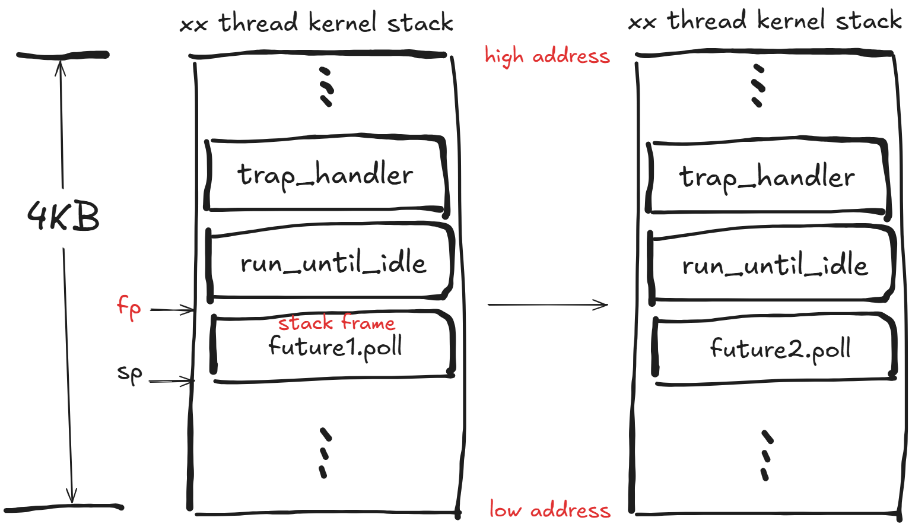

# rcoren 异步 timer 开发

## 1. 开发日志

[rcoren 异步 timer 开发日志](./async-timer-dev-log.md)

## 2. 对堆栈复用的理解

rust future 就是一个协程，future 中的属性相当于该协程的状态，类比于线程栈上的变量；而 future 中的方法相当于该协程的代码，类比于线程执行的代码。线程是有自己的栈的，线程代码都会跳到自己的栈去执行；而 rust future 协程是**没有**自己的栈的，因此谁调用它，它就**复用**谁的栈并在谁的栈上运行自己的 poll 代码。所以，从 os `trap_handler` 到 `Executor::run_until_idle` 中对 future 进行 poll，future 的 poll 也即协程的执行用的**还是** `trap_handler` 的栈，且在 `Executor::run_until_idle` 里面的 while 循环的每一次 poll 用的也都是同一个栈，即都是用的 `trap_handler` 的栈，这也就是 rust future 无栈协程相对于线程的堆栈复用。

>注：由于 rCore-N 不支持嵌套中断，于是 rCore-N 中 os`trap_handler` 使用的栈是被打断线程的**内核栈**



如上图所示，对于 `Executor::run_until_idle` 中每轮 while 循环的 poll，**栈帧的 fp 都是不变的**。

综上分析，如果需要通过实验来验证 rust future 无栈协程的堆栈复用性，只需要在 `Executor::run_until_idle` 中循环的每一次 poll 的时候，检查栈是否不变，这可以通过检测每一次 poll 时的 fp 看是否发生变化来实现。而在我们的设计中，所有 future 栈帧的大小是一样的，所以更方便的做法是**检测每次 poll 时 sp 是否发生变化**。

## 3. 验证正确性

直接用 `debug!()` 进行输出并不方便。针对异步 timer 的情况，由于 os 时间片很短，因此输出会很多很快。

在 `AsyncTimerFuture` 的 poll 函数开头：

```rust
// 通过输出查看每次 poll 时 sp 是否变化
let current_sp: usize;
unsafe {
    asm!("mv {}, sp", out(reg) current_sp);
}
debug!("future poll, sp: {:#x}", current_sp);
```

有没有更好的方法呢。