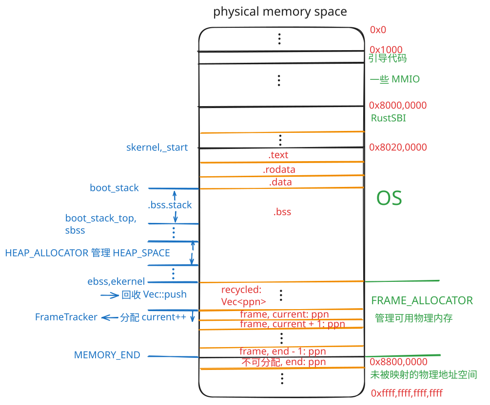
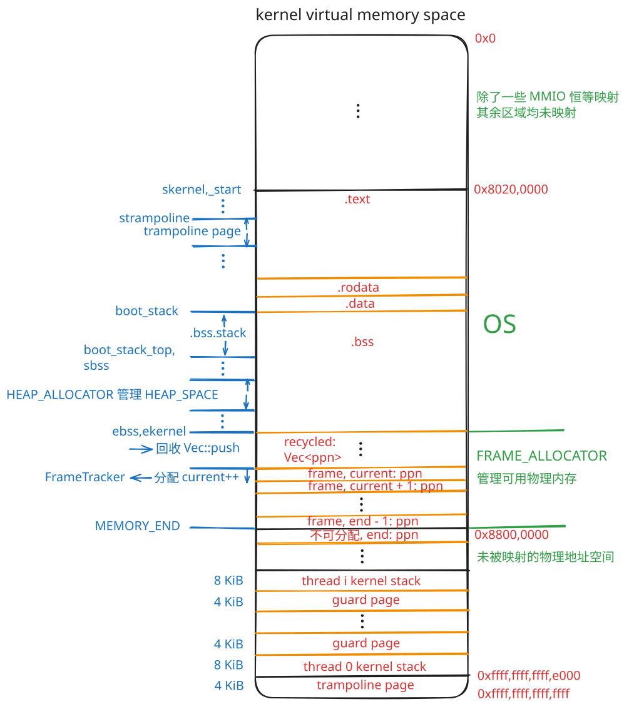
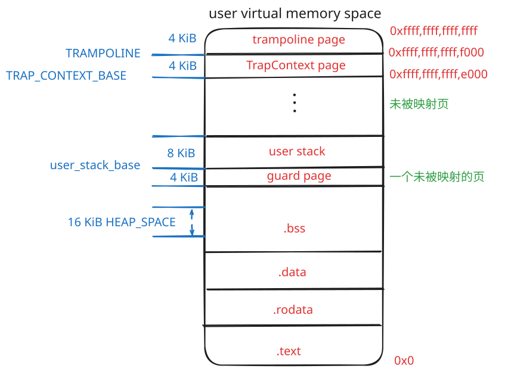

# rCore-2025S 总结

把 rCore 的一些重要性质总结在这里，作为复习。

注：**某些设计和值和 rCore-N 存在差别**（如：留给 os 的栈空间 `boot_stack` 的大小, rCore-N 是 4096 * 16 * 4 字节，而 rCore 如下所述是 4096 * 16 字节）。以下内容如果没有提及具体章节，均以 rCore-2025S 的 ch8 分支为准。

以下内容不会涉及到文件系统章节。

## 1. 内存布局

### 1.1. 图示

#### 物理地址空间布局



RustSBI 作为 bootloader 运行在 M 态。OS 为 S 态，用户为 U 态。

OS 中的各个段之间如有必要会进行补齐以保证各段从 4K 倍地址开始。

#### 内核虚拟地址空间布局



`satp.MODE` 为 0 则所有访存为物理地址，为 8 则 `S/U` 态访存为虚拟地址需经 MMU 转换。MMU 将 39 位虚拟地址转换为 56 位物理地址。

rCore 使用 SV39 多级页表机制。SV39 地址空间虽然位宽为 64 位，但因为 64 位地址的高 25 位必须与第 38 位（从第 0 位开始的）保持一致，所以只有低 2^38 (256 GiB) 个地址（第 38 位为 0）和高 2^38 个地址（第 38 位为 1）是有效的。

rCore 的页大小 `PAGE_SIZE` 为 4 KiB。

虚拟内存映射到物理内存有两种方式：`Framed` 和 `Identical`，前者把虚拟内存映射到 `FRAME_ALLOCATOR` 管理的物理内存区域，而后者把虚拟内存映射到相等的物理内存。

内核代码访存虽然也是虚拟地址，但是几乎全都是恒等映射，即**内核访存虚拟地址等于物理地址**，可以去看 `MemorySet::new_kernel` 的代码，包括了 `os/src/linker.ld` 中的全部段和 MMIO 外设，**只有 trampoline 页和线程内核栈两个例外**。这两个例外在内核虚拟内存空间位于**最顶部**，映射到物理空间中，虚拟地址 `TRAMPOLINE` 被映射到物理内存中位于 os 的 `.text` 段的 `strampoline`，而线程内核栈被映射到物理内存中 `FRAME_ALLOCATOR` 管理的区域。可以去看 ch4 的[指导书](https://learningos.cn/rCore-Tutorial-Guide-2025S/chapter4/5kernel-app-spaces.html#id5)。

#### 用户虚拟地址空间布局



用户虚拟地址空间的 trampoline 页也会被映射到物理地址空间中 os 的 `.text` 段中的 trampoline 页。

>#### 关于 trampoline 页
>
>简单来说，在 U 态/S 态之间切换的时候与**换页表**相关。
>
>trampoline 页中存放着 `os/src/trap.S` 中的 `__alltraps` 和 `__restore` 代码。
>
>`TrapContext` 顾名思义存放 Trap 上下文。`TrapContext::kernel_sp` 存放着当前线程内核栈的虚拟地址；而 `TrapContext::kernel_satp` 记录了内核根页表的 `PPN`, 由 U 态到 S 态后切换页表时会将这个值赋给 `satp` CSR, 在 `__alltraps` 中可以看到。
>
>`TrapContext` 页的映射是 `Framed` 的。
>
>用户虚拟地址空间的 `TrapContext` 页和 trampoline 页**绝对不能**被用户态代码访问。
>
>trampoline 页存在的意义是保证在换页表前后的 pc 在用户虚拟地址空间和在内核虚拟地址空间中均指向相同的物理页面。否则切换页表后地址空间变了但 pc 没变，CPU 试图执行下一条语句时就会马上出错。
>
>`TrapContext` 页存在的意义：如果将 Trap 上下文保存在线程内核栈中，那就会出现**悖论**：如果 `TrapContext` 放到内核栈中，那你访问内核栈就需要先知道 `kernel_sp`, 但你要先访问内核栈上的 `TrapContext` 才能知道 `kernel_sp`, 从而产生悖论。

### 1.2. 堆与栈

#### OS 的堆与栈

**os 的 `.bss.stack` 栈空间与堆空间都不是给用户程序用的，而是给 os 自己用的**。

OS 的 `.bss.stack` 段被用作 OS 的栈空间，大小为 4096 * 16 字节即 64 KiB。这个 os 的 `.bss.stack` 栈是专门给 `rust_main` 和 idle 进程用的。

关于 OS 的堆空间，可以参考 `os/src/mm/heap_allocator.rs` 中的 `HEAP_SPACE` 这个 `static` 全局数组。其被初始化为全 0, 因此会被放在 `heap_allocator.rs` 编译汇编后二进制文件中的 `.bss` 段。而链接器会根据 `os/src/linker.ld` 中的如下内容：

```asm
.bss : {
    *(.bss.stack)
    sbss = .;
    *(.bss .bss.*)
    *(.sbss .sbss.*)
}

. = ALIGN(4K);
ebss = .;
```

将来自各个二进制文件中的相关段按顺序拼接，于是 `HEAP_SPACE` 被放置在 os 中的 `.bss` 段的 `sbss` 和 `ebss` 之间。其中的关键代码是这行：`*(.bss .bss.*)`。

直到加载器介入之前， `HEAP_SPACE` 并非被立即分配了一大块全 0 空间，而只是被标记，等待后续加载的时候才会实际分配空间并清零。而承担了 os 的加载器功能的，我的理解一共有三部分： `qemu-system-riscv64`, RustSBI 和 os 自己, 一个负责把 os 二进制文件加载到内存中，一个负责跳转到 os 执行；而 os 自己的一部分代码负责将 `.bss` 段清零，在 `rust_main` 中首先被执行的 `clear_bss` 的函数负责将 `sbss` 段和 `ebss` 段之间的空间清零。

```rust
fn clear_bss() {
    extern "C" {
        fn sbss();
        fn ebss();
    }
    unsafe {
        core::slice::from_raw_parts_mut(sbss as usize as *mut u8, ebss as usize - sbss as usize)
            .fill(0);
    }
}
```

`HEAP_SPACE` 的大小 `KERNEL_HEAP_SIZE` 为 `0x200_0000` 字节即 32 MiB。注意支持了**虚拟内存**后，用户程序不再需要硬编码到 `0x80400000`, 所以不用像 ch3 一样只为 os 堆预留 `0x20000` 字节即 128 KiB 的空间以防止 os 堆覆盖用户程序。

由 `HEAP_ALLOCATOR` 管理 `HEAP_SPACE`。比如在内核中写代码写了个 `Box::new()`，便会向 `HEAP_ALLOCATOR` 申请内核堆上的空间。

>##### 内核代码是如何向 `HEAP_ALLOCATOR` 申请内存的
>
>`#[global_allocator]` 编译器指令会告诉 Rust 编译器，如果在代码中任何地方需要申请内存，则不要使用默认的 `malloc`，而是使用该变量。
>
>```rust
>use buddy_system_allocator::LockedHeap;
>
>#[global_allocator]
>/// heap allocator instance
>static HEAP_ALLOCATOR: LockedHeap = LockedHeap::empty();
>```
>
>Rust 规定，被标记为 `#[global_allocator]` 的变量，必须实现 `GlobalAlloc` trait，这个可以去看 `LockedHeap` 的源代码。

#### 用户的堆与栈

用户程序的栈空间是 os 在加载用户程序时为用户程序分配的（来自 `FRAME_ALLOCATOR`，可以去看 `TaskUserRes::alloc_user_res()` 的代码）；而用户程序申请释放用户堆空间的话，可以去看用户程序库中 `user/src/lib.rs` 的代码，里面实现了一套和上述 OS `HEAP_ALLOCATOR` 完全一致的代码逻辑：

```rust
const USER_HEAP_SIZE: usize = 16384;

static mut HEAP_SPACE: [u8; USER_HEAP_SIZE] = [0; USER_HEAP_SIZE];

#[global_allocator]
static HEAP: LockedHeap = LockedHeap::empty();

#[no_mangle]
#[link_section = ".text.entry"]
pub extern "C" fn _start(argc: usize, argv: usize) -> ! {
    clear_bss();
    unsafe {
        HEAP.lock()
            .init(HEAP_SPACE.as_ptr() as usize, USER_HEAP_SIZE);
    }
    // ...
}
```

和 os 中的逻辑一样地，这里的 `HEAP_SPACE` 也会放到用户程序编译汇编后二进制文件的中的 `.bss` 段。但是查看 os 中 `MemorySet::from_elf` 和 `MemorySet::from_existed_user` 的逻辑可以发现，除了 trampoline 的映射外（既不是 `Framed` 的又不是 `Identical` 的。看代码可以发现 trampoline 不受或者说**绕过**了 `MapArea` 的管理，所以无所谓 `Framed` 或者 `Identical`，它的映射直接手动调用了 `PageTable` 的 `map`），用户程序的其余所有部分都是 `Framed` 映射，因此在用户程序眼中的 `HEAP_SPACE` 会被映射到物理地址空间中 `FRAME_ALLOCATOR` 管理的区域。所以用户堆空间在物理地址空间中是放在 `FRAME_ALLOCATOR` 管理的区域中。

用户申请用户堆空间内存的方式应**区分于**通过 `sys_map` 和 `sys_unmap` 系统调用（见 ch4 练习）向 `FRAME_ALLOCATOR` 申请内存的方式。

## 2. 加电执行

用 QEMU 软件 `qemu-system-riscv64` 来模拟 RISC-V 64 计算机，运行该软件即给该虚拟计算机加电。此时，CPU 的其它通用寄存器清零，而 PC 会指向 `0x1000` 的位置，这里有固化在硬件中的一小段引导代码， 它会很快跳转到 `0x80000000` 的 RustSBI 处。RustSBI 完成硬件初始化后，跳转到 `0x80200000` 的 OS 处即 `entry.asm` 中的 `_start` 处执行：

```asm
_start:
    la sp, boot_stack_top
    call rust_main
```

`rust_main` 主要做了以下几件事：

- `clear_bss()`: 清零 `.bss` 段中从 `sbss` 到 `ebss` 的部分
- `mm::init()`: 初始化 `FRAME_ALLOCATOR` 和 `HEAP_ALLOCATOR`
- `trap::init()`: 调用 `set_kernel_trap_entry()` 设置 `stvec` CSR 规定当**内核代码出问题时**应该跳到哪里。顺便提一下，进入 S 态 `trap_handler` 首先就会调用 `set_kernel_trap_entry()` 设置 `stvec`，将从 S 态 `trap_handler` 返回 U 态时在 `trap_return` 中首先就会调用 `set_user_trap_entry()` 设置 `stvec`
- `trap::enable_timer_interrupt()`: 使能 S 态时钟中断
- `timer::set_next_trigger()`: os 时间片相关，设置下一次硬件时钟中断的到来
- `task::add_initproc()`: `INITPROC.clone()` 触发 `INITPROC` 的 `lazy_static`，在 pcb `new` 中将 initproc 加到 `TASK_MANAGER` 中去
- `task::run_tasks()`: idle 进程，进行进程调度

```rust
#[no_mangle]
/// the rust entry-point of os
pub fn rust_main() -> ! {
    clear_bss();
    println!("[kernel] Hello, world!");
    logging::init();
    mm::init();
    mm::remap_test();
    trap::init();
    trap::enable_timer_interrupt();
    timer::set_next_trigger();
    fs::list_apps();
    task::add_initproc();
    task::run_tasks();
    panic!("Unreachable in rust_main!");
}
```

## 3. 进程线程相关

### 3.1. 几个特殊的进程

#### 0 号进程

从 `entry.asm` 到 `rust_main` 都可以看作 0 号进程。

#### idle 进程

0 号进程完成初始化工作后变成 idle 进程（即在 `rust_main` 中进入 `task::run_tasks()` 中的循环）。其实 0 号进程和 idle 进程是同一个进程，pid 为 0。当系统没有其它可运行的线程时会调度 idle 进程运行。idle 进程没有 tcb（所以 PID 0 是**概念上**的），不需要被 scheduler 管理，因为它自己就是 scheduler。**直到目前为止，还是在用 os 的 `.bss.stack` 栈**。

#### 1 号进程

pid 为 1, `initproc`，对应的程序名为 `ch8b_initproc`，由 0 号进程创建，这与后续进程都是 `fork()` 创建不同（当然 ch5 作业还有 `sys_spawn` 创建）。1 号进程是后续所有进程的祖先，还负责收尸孤儿进程。

注意 `ch8b_initproc` **不是**你看到的 shell 程序，可以去看 `user/src/bin/ch8b_initproc.rs` 的源码。可以发现 `initproc` 和 user shell 是父子关系。shell 程序是 PID 2，对应的源文件为 `ch7b_user_shell`。

从 1 号进程开始的所有进程，使用的均是**用户栈**和**内核栈**两套栈。用户栈和内核栈在物理地址空间上均位于 `FRAME_ALLOCATOR` 管理的区域。

线程的用户栈和内核栈大小都是 8 KiB（自 ch4 开始）。